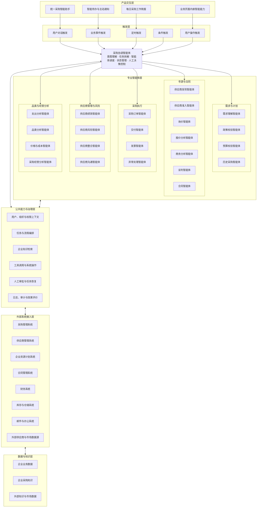

# 采购多智能体系统产品与架构设计方案

## 1. 文档目标

本文用于定义面向企业内部采购部门的多智能体系统，包括产品形态、智能体架构、触发与交互方式、外部系统对接、专业智能体能力边界，以及权限治理与首期建设建议。

系统的核心目标不是增加一个“采购聊天机器人”，而是让智能体真正进入采购流程，承担信息收集、规则判断、流程推进、异常处理、分析决策支持等工作，从而实现：

- 减少采购人员重复、事务性操作
- 缩短采购需求到下单、交付、付款的整体周期
- 提升寻源、比价、谈判、合同和供应商管理质量
- 提前发现供应、价格、合同和履约风险
- 将采购人员从“推动流程”转向“处理例外和做关键决策”
- 逐步沉淀企业采购知识与决策能力

---

## 2. 产品定位

### 2.1 产品定位

系统定位为企业内部统一的“采购智能工作平台”。

前台对用户提供一个统一的采购智能助手入口，后台由一个采购协调智能体和多个专业智能体协同工作，并与企业现有采购、供应商、合同、财务、库存、邮件等系统连接。

整体原则是：

> 用户看到的是一个采购智能助手，后台运行的是多个专业智能体。

系统不建议一开始做成每个采购员一个独立智能体，也不需要按照软件即服务产品的方式建设多租户架构。更适合采用：

- 单企业部署
- 统一智能体平台
- 多组织、多角色、多权限上下文
- 后台多智能体协同
- 按业务事件主动触发
- 关键节点保留人工审批

### 2.2 系统核心价值

系统希望实现三类转变：

1. **从“人主动找系统”转向“系统主动处理”**
2. **从“人推动流程”转向“智能体推进流程，人处理例外”**
3. **从“单点智能功能”转向“跨系统、跨环节的采购任务协同”**

---

## 3. 产品形态设计

采购多智能体系统不应只有聊天界面，而应形成“统一入口 + 流程嵌入 + 主动触发 + 人机协同”的产品形态。

### 3.1 统一采购智能助手

为采购人员、采购经理和相关业务人员提供统一入口，可以嵌入：

- 企业门户
- 采购管理系统
- 供应商管理系统
- 企业协同工具
- 企业移动端
- 内部办公平台

用户可以通过自然语言完成开放式任务，例如：

- 帮我看看今天有哪些采购事项需要处理
- 帮我找五家满足要求的供应商
- 帮我比较这三家供应商的报价
- 帮我分析这个供应商最近半年为什么交付变差
- 帮我准备明天的供应商谈判方案
- 帮我检查这份采购合同
- 帮我看看哪些合同未来三个月需要续签

统一采购智能助手负责接收用户意图，并交由采购协调智能体进行任务拆解和调度。

### 3.2 业务页面内嵌智能能力

除了统一聊天入口，智能能力应直接出现在业务发生的页面中。

| 业务页面 | 内嵌智能能力 |
|---|---|
| 采购申请页面 | 需求完整性检查、采购方式建议、预算和政策校验 |
| 供应商页面 | 供应商综合分析、风险分析、绩效分析 |
| 询价页面 | 询价文件生成、供应商推荐、报价进度跟踪 |
| 报价页面 | 报价标准化、总成本分析、历史价格比较 |
| 合同页面 | 条款审查、风险提示、历史版本比较 |
| 采购订单页面 | 交付风险分析、催交建议 |
| 发票页面 | 三单匹配、异常原因判断 |
| 品类页面 | 支出分析、价格趋势、供应市场分析 |

这类产品形态可以避免用户为了使用智能能力频繁离开业务系统进入聊天窗口。

### 3.3 主动通知与待办中心

系统应提供统一的智能待办中心，由智能体主动把需要关注的事项推送给用户。

建议分为三级：

#### 信息通知

仅告知结果，无需用户操作。

例如：

- 供应商已确认采购订单
- 三家供应商均已完成报价
- 合同已完成归档

#### 需要关注

系统发现潜在风险或机会，但不强制用户立即处理。

例如：

- 某供应商预计延期三天
- 某品类采购价格较历史均值上涨 8%
- 某合同将在 60 天后到期

#### 需要决策

智能体已经完成分析，需要人作出明确决定。

例如：

- 供应商定标审批
- 超预算采购审批
- 合同高风险条款确认
- 重新谈判还是接受报价
- 是否启用第二供应源

### 3.4 每日采购工作简报

系统可以在每天固定时间自动生成采购工作简报，例如：

- 今日需要处理的采购申请
- 即将截止的询价项目
- 延迟风险较高的采购订单
- 未来三个月到期的合同
- 供应商风险变化
- 价格异常
- 发票和付款异常
- 智能体已经自动完成的事项
- 需要采购人员决策的事项

目标是让采购人员每天首先看到“今天真正值得处理的事情”，而不是先打开多个系统逐个查找。

---

## 4. 触发与交互机制

系统建议支持五类触发方式。

### 4.1 用户对话触发

由用户主动发起。

例如：

> 帮我找五家可以生产某类铝合金结构件的供应商。

采购协调智能体判断任务需要哪些专业智能体参与，然后组织执行。

### 4.2 业务事件触发

企业内部系统发生业务事件后自动触发。

典型事件包括：

- 新采购申请创建
- 采购申请审批完成
- 供应商提交报价
- 询价截止
- 合同上传
- 合同即将到期
- 采购订单创建
- 供应商未及时确认采购订单
- 预计交付延期
- 收货完成
- 发票收到
- 三单匹配失败
- 供应商绩效下降
- 供应商风险等级变化

这是整个系统最重要的触发方式。

### 4.3 定时触发

按照固定频率运行。

例如：

- 每日检查采购订单交付风险
- 每周检查供应商绩效变化
- 每月进行采购支出分析
- 每月检查合同到期情况
- 每季度生成供应商绩效报告
- 每季度进行品类价格趋势分析

### 4.4 条件触发

当某一业务条件满足时自动运行。

例如：

- 某供应商报价高于历史价格 10%
- 某采购订单预计交付时间晚于要求交付时间
- 某供应商风险评分超过阈值
- 某品类市场价格一个月内上涨超过 8%
- 某供应商连续两个月交付绩效下降
- 某采购申请超过规定处理时长

条件触发的价值在于让系统从“定期检查”升级为“情况发生变化时主动行动”。

### 4.5 用户操作触发

用户在业务页面点击某个智能操作。

例如：

- 智能分析供应商
- 智能生成询价文件
- 智能比价
- 智能合同审查
- 生成谈判策略
- 分析交付风险
- 分析发票异常

---

## 5. 总体智能体架构

### 5.1 架构原则

建议采用：

> 一个采购协调智能体 + 多个专业智能体 + 统一工具与知识层

用户一般不直接选择某个专业智能体，而是通过统一采购智能助手或者业务事件进入系统，由采购协调智能体判断应该调用哪些专业智能体。

### 5.2 总体结构

```text
                         用户 / 业务事件 / 定时任务
                                   │
                                   ▼
                           采购智能助手入口
                                   │
                                   ▼
                           采购协调智能体
                                   │
        ┌──────────────────────────┼──────────────────────────┐
        │                          │                          │
        ▼                          ▼                          ▼
   需求与计划域                寻源与合同域               采购执行域
        │                          │                          │
   需求理解智能体             供应商发现智能体            采购订单智能体
   政策校验智能体             供应商准入智能体            交付智能体
   预算校验智能体             询价智能体                  发票智能体
   历史采购智能体             报价分析智能体              异常处理智能体
                              商务分析智能体
                              谈判智能体
                              合同智能体

        ┌──────────────────────────┴──────────────────────────┐
        │                                                     │
        ▼                                                     ▼
  供应商管理与风险域                                      品类与经营分析域
        │                                                     │
  供应商绩效智能体                                      支出分析智能体
  供应商风险智能体                                      品类分析智能体
  供应商整合智能体                                      价格与成本智能体
  供应商沟通智能体                                      采购经营分析智能体
```


### 5.3 产品整体架构图

下图从产品入口、触发机制、智能体协同、公共能力、外部系统和数据知识六个层面展示系统整体形态。



图中需要重点把握三个边界：

1. **用户入口与专业智能体解耦**：用户通常只面对统一采购智能助手或业务页面，不需要知道后台具体调用了哪个智能体。
2. **专业智能体与业务系统解耦**：专业智能体优先通过统一工具和系统接入能力访问采购、供应商、财务等系统，避免每个智能体分别建设一套接口。
3. **权限、审批和审计属于平台公共能力**：不能由某个专业智能体自行决定是否绕过权限或审批规则。

---

## 6. 采购协调智能体设计

采购协调智能体是整个多智能体系统的核心。

它本身不承担所有具体业务分析，而是负责理解任务、拆解任务、调用专业智能体、管理任务状态和控制人工决策节点。

### 6.1 核心职责

1. 理解用户意图或业务事件
2. 判断任务属于哪个采购场景
3. 将复杂任务拆成多个子任务
4. 选择并调用对应专业智能体
5. 管理多个智能体之间的执行顺序和依赖
6. 汇总多个智能体的输出
7. 判断是否需要人工审批
8. 暂停和恢复流程
9. 处理执行失败、冲突和超时
10. 形成统一、可解释的最终结果

### 6.2 执行上下文

每一次智能体执行，都必须携带明确的业务上下文，例如：

```text
用户
角色
部门
法人主体
业务单元
采购组织
负责品类
数据权限
操作权限
当前业务对象
当前任务
```

这样才能保证同一套智能体能力面对不同用户时，访问不同的数据并执行不同的操作。

---

## 7. 专业智能体功能说明

### 7.1 需求理解智能体

主要职责：

- 理解自然语言采购需求
- 提取品类、数量、规格、交期、预算、交货地点等信息
- 判断需求是否完整
- 主动补问缺失信息
- 将自然语言需求转化为结构化采购需求
- 识别可能存在的重复采购或历史采购项目

典型输出：

- 结构化采购需求
- 缺失信息清单
- 需求完整性评分
- 历史相似采购记录

### 7.2 政策校验智能体

主要职责：

- 判断适用的采购制度
- 判断应采用询价、招标、框架协议、单一来源等哪种采购方式
- 判断最低供应商数量要求
- 检查审批流程
- 判断是否需要法务、财务或管理层参与
- 识别违反采购制度的情况

典型输出：

- 推荐采购路径
- 必要审批节点
- 合规风险提示
- 对应制度依据

### 7.3 预算校验智能体

主要职责：

- 检查预算是否存在
- 检查剩余预算
- 检查预算科目
- 判断是否超预算
- 对接财务系统获取预算状态
- 对超预算情况给出处理建议

### 7.4 历史采购智能体

主要职责：

- 查找历史相似采购项目
- 查找历史供应商
- 对比历史成交价
- 查找历史合同、询价和谈判记录
- 识别重复采购机会
- 为寻源、报价分析和谈判提供历史依据

### 7.5 供应商发现智能体

主要职责：

- 在内部供应商库中寻找候选供应商
- 从历史交易中寻找潜在供应商
- 根据能力、地域、产能、认证等条件筛选
- 在允许的情况下接入外部公开信息寻找新供应商
- 生成候选供应商清单
- 给出供应商匹配理由

### 7.6 供应商准入智能体

主要职责：

- 收集供应商准入资料
- 检查营业资质、认证、税务等信息
- 检查资料完整性和有效期
- 调用供应商风险智能体进行风险扫描
- 推动内部准入审批
- 完成供应商主数据建档前的准备

### 7.7 询价智能体

主要职责：

- 自动生成询价文件
- 根据采购策略选择邀请供应商
- 发送询价通知
- 跟踪供应商响应
- 自动提醒尚未报价的供应商
- 统一管理供应商澄清问题
- 在询价截止后触发报价分析

### 7.8 报价分析智能体

主要职责：

- 读取电子表格、文档、邮件附件中的报价
- 将不同格式报价转换成统一结构
- 比较单价、税率、运费、模具费、最低采购量、账期、交期等
- 计算采购总成本
- 对比历史价格
- 识别异常报价
- 输出标准化比价表

### 7.9 商务分析智能体

主要职责：

- 综合价格、交付、质量、风险、账期、历史表现
- 形成供应商综合评分
- 分析不同采购方案的优劣
- 输出供应商选择建议
- 生成定标分析材料

### 7.10 谈判智能体

主要职责：

- 分析供应商报价与历史成交价
- 分析成本变化和市场价格
- 形成目标价、理想价和底线建议
- 生成谈判策略
- 设计让步顺序
- 生成谈判问题和沟通话术
- 记录谈判结果
- 在低风险场景下辅助自动化谈判

重要原则：

战略性、高金额采购应以“智能体辅助、人类决策”为主，不建议一开始允许完全自动谈判或自动定标。

### 7.11 合同智能体

主要职责：

- 根据采购结果生成合同初稿
- 与标准模板比较
- 提取关键条款
- 检查付款、交付、违约、质保、知识产权等风险
- 标记非标准条款
- 对比历史合同版本
- 识别合同到期时间
- 触发续签或重新谈判流程

### 7.12 采购订单智能体

主要职责：

- 根据审批结果和合同生成采购订单
- 校验供应商、价格、数量和交期
- 校验采购订单与合同的一致性
- 推送供应商确认
- 跟踪供应商是否确认订单
- 对异常订单进行提醒

### 7.13 交付智能体

主要职责：

- 跟踪供应商生产和发货进度
- 预测预计到货时间
- 判断是否存在延期风险
- 自动催交
- 分析延期原因
- 在必要时升级给采购人员
- 记录供应商履约表现

### 7.14 发票智能体

主要职责：

- 读取供应商发票
- 对比采购订单、收货记录和发票
- 完成三单匹配
- 发现价格、数量、税率等差异
- 自动判断常见差异原因
- 对简单异常尝试自动解决
- 对复杂异常升级给采购或财务人员

### 7.15 供应商绩效智能体

主要职责：

- 计算准时交付率
- 分析质量表现
- 分析响应速度
- 分析价格竞争力
- 分析问题处理效率
- 形成供应商综合绩效评分
- 识别绩效持续下降的供应商
- 提出降低份额、改善或替代建议

### 7.16 供应商风险智能体

主要职责：

- 监控供应商经营风险
- 监控法律和合规风险
- 监控财务风险
- 监控舆情和重大事件
- 监控供应链和地缘风险
- 动态调整风险等级
- 对关键供应商风险变化主动预警

### 7.17 供应商沟通智能体

主要职责：

- 自动发送询价、催报价、催交、资料补充等通知
- 理解供应商回复
- 自动归类供应商问题
- 对标准问题自动回复
- 对涉及商务承诺和重大变更的问题升级给采购员
- 形成完整沟通记录

### 7.18 支出分析智能体

主要职责：

- 对采购支出进行自动分类
- 统一供应商名称和品类名称
- 分析支出集中度
- 识别采购碎片化
- 发现非协议采购和异常采购
- 发现供应商整合机会
- 形成降本机会清单

### 7.19 品类分析智能体

主要职责：

- 分析品类采购金额和需求趋势
- 分析市场供需变化
- 分析关键原材料价格
- 分析供应商产能
- 形成品类策略建议
- 提出长协、锁价、现货采购等策略建议
- 支持品类经理进行中长期决策

### 7.20 采购经营分析智能体

主要面向采购经理和采购负责人。

主要职责：

- 自动生成采购经营报告
- 分析降本金额
- 分析采购周期
- 分析供应商集中度
- 分析供应风险
- 分析合同覆盖率
- 分析采购流程瓶颈
- 回答管理层自然语言问题

例如：

- 本季度为什么采购周期变长？
- 哪三个品类最有降本空间？
- 哪些核心供应商风险正在上升？
- 哪些采购团队积压最严重？

---

## 8. 外部系统对接设计

采购智能体系统本身不应替代企业现有业务系统。

现有系统继续作为正式业务数据的记录系统，智能体系统负责理解、分析、协调和执行。

### 8.1 建议对接的核心系统

| 外部系统 | 主要获取内容 | 智能体主要用途 |
|---|---|---|
| 采购管理系统 | 采购申请、询价、订单、审批 | 采购流程执行 |
| 供应商管理系统 | 供应商主数据、准入、绩效 | 供应商管理 |
| 企业资源计划系统 | 采购订单、库存、收货、财务数据 | 订单、预算、库存、对账 |
| 合同管理系统 | 合同正文、条款、状态、到期时间 | 合同智能体 |
| 财务系统 | 预算、发票、付款状态 | 预算和发票智能体 |
| 库存与仓储系统 | 库存水位、收货信息 | 需求和交付智能体 |
| 邮件系统 | 报价、合同、供应商沟通 | 报价和沟通智能体 |
| 企业办公系统 | 审批、待办、通知 | 人工审批和通知 |
| 外部供应商数据源 | 工商、风险、认证、行业信息 | 寻源和风险分析 |
| 市场与商品数据源 | 原材料价格、市场指数 | 品类和价格分析 |

---

## 9. 外部系统对接方式

建议支持四种对接方式。

### 9.1 接口调用

用于智能体主动查询和写入业务数据，例如：

- 查询采购申请
- 查询供应商
- 创建询价
- 创建采购订单
- 查询合同
- 查询预算
- 更新任务状态

### 9.2 业务事件订阅

外部系统在关键业务状态变化时主动发送事件，例如：

```text
采购申请已创建
供应商已报价
询价已截止
合同已上传
采购订单已创建
收货已完成
发票已收到
```

采购多智能体系统收到事件后，由采购协调智能体决定启动哪个流程。

建议建设统一的“采购事件中心”，避免每个专业智能体直接与大量业务系统耦合。

### 9.3 数据同步

对于分析类场景，可定期同步：

- 历史采购数据
- 供应商绩效数据
- 合同数据
- 价格数据
- 采购订单数据
- 支出数据

进入采购智能数据层，供智能体进行分析。

### 9.4 文档与消息接入

对于大量存在于非结构化内容中的信息，需要接入：

- 邮件正文
- 邮件附件
- 电子表格
- 文本文档
- 合同
- 报价单
- 供应商证明材料

智能体负责将其转换成结构化采购信息。

---

## 10. 系统数据与知识架构

建议将数据分为三类。

### 10.1 企业业务数据

包括：

- 采购申请
- 询价
- 报价
- 采购订单
- 收货
- 发票
- 付款
- 供应商
- 合同
- 库存

这些数据主要来自企业现有业务系统。

### 10.2 企业采购知识

包括：

- 采购制度
- 审批规则
- 合同模板
- 品类策略
- 供应商准入规则
- 谈判方法
- 历史案例
- 标准操作流程

### 10.3 外部知识

包括：

- 公开供应商资料
- 工商风险信息
- 行业市场信息
- 原材料价格
- 产业链信息
- 法规与认证信息

---

## 11. 权限与治理设计

采购智能体会接触价格、合同、供应商、预算等敏感信息，因此权限和治理必须从第一版开始建设。

### 11.1 权限模型

建议至少支持：

```text
用户
角色
部门
法人主体
业务单元
采购组织
负责品类
数据范围
操作权限
审批权限
```

同一个专业智能体，在不同用户下访问的数据和可执行动作应该不同。

### 11.2 人工决策节点

建议将任务分为三种自动化等级。

#### 第一等级：智能辅助

智能体分析和建议，人执行。

适合：

- 战略采购
- 高金额采购
- 高风险合同
- 核心供应商管理

#### 第二等级：智能执行，人工审批

智能体完成大部分工作，在关键节点等待人批准。

适合：

- 询价
- 比价
- 供应商选择建议
- 合同生成
- 采购订单生成

#### 第三等级：有限自主执行

低金额、低风险、规则清晰的任务可以由智能体自动完成。

适合：

- 标准办公用品
- 小额重复采购
- 标准催报价
- 标准催交
- 三单匹配中的简单异常

---

## 12. 典型端到端流程示例

以“采购 200 台办公显示器”为例。

```text
用户提交采购需求
        │
        ▼
需求理解智能体
识别数量、规格、预算、交期
        │
        ▼
政策校验智能体
判断是否需要三家询价
        │
        ▼
预算校验智能体
检查预算
        │
        ▼
历史采购智能体
查找历史价格和供应商
        │
        ▼
供应商发现智能体
生成候选供应商
        │
        ▼
询价智能体
生成并发送询价
        │
        ▼
供应商提交报价
        │
        ▼
报价分析智能体
统一报价并计算总成本
        │
        ▼
商务分析智能体
形成供应商综合评分
        │
        ▼
谈判智能体
生成谈判建议
        │
        ▼
人工定标审批
        │
        ▼
合同智能体
生成并检查合同
        │
        ▼
采购订单智能体
生成采购订单
        │
        ▼
交付智能体
持续跟踪交付
        │
        ▼
收货
        │
        ▼
发票智能体
完成三单匹配
```

这个流程中，用户无需不断进入不同系统推动每一步。智能体负责自动推进，只有关键决策节点才需要人介入。


### 12.1 采购业务流程与智能体触发关系图

下图重点展示采购业务从需求产生到发票处理的主流程，以及各阶段的主要触发方式、参与智能体和人工控制点。

```mermaid
flowchart LR
    U[用户提出需求] --> I1[需求创建]
    F[需求预测或库存条件触发] --> I1
    PR[采购系统产生新采购申请事件] --> I1

    I1 --> A1[需求理解智能体\n政策校验智能体\n预算校验智能体\n历史采购智能体]
    A1 --> H1{是否需要人工审批}
    H1 -- 是 --> AP1[采购申请审批]
    H1 -- 否 --> S0[进入寻源]
    AP1 --> S0

    S0 --> A2[供应商发现智能体\n供应商准入智能体\n询价智能体]
    A2 --> Q1[供应商提交报价\n邮件或采购系统事件]
    Q1 --> A3[报价分析智能体\n商务分析智能体]
    A3 --> C1{报价是否异常或需谈判}
    C1 -- 是 --> A4[谈判智能体]
    C1 -- 否 --> H2[定标建议]
    A4 --> H2
    H2 --> AP2[人工定标审批]

    AP2 --> A5[合同智能体]
    A5 --> H3{是否存在高风险或非标准条款}
    H3 -- 是 --> AP3[人工合同审批]
    H3 -- 否 --> O1[生成采购订单]
    AP3 --> O1

    O1 --> A6[采购订单智能体]
    A6 --> D1[订单已发送]
    D1 --> M1[交付智能体持续监控]
    M1 --> C2{预计延期或供应商未确认}
    C2 -- 是 --> A7[供应商沟通智能体\n自动催交与原因分析]
    C2 -- 否 --> R1[正常收货]
    A7 --> H4{是否需要采购人员介入}
    H4 -- 是 --> AP4[人工处理交付异常]
    H4 -- 否 --> M1
    AP4 --> M1
    M1 --> R1

    R1 --> IV1[收到发票事件]
    IV1 --> A8[发票智能体\n采购订单、收货、发票三单匹配]
    A8 --> C3{是否存在异常}
    C3 -- 否 --> PAY[进入付款流程]
    C3 -- 是 --> A9[异常处理智能体\n判断原因并尝试自动解决]
    A9 --> C4{能否按规则自动解决}
    C4 -- 是 --> PAY
    C4 -- 否 --> AP5[采购或财务人工处理]
    AP5 --> PAY

    T1[定时触发：每日交付、合同、绩效巡检] -.-> M1
    T2[条件触发：价格、风险、延期超过阈值] -.-> A3
    T2 -.-> M1
    T3[定时或条件触发：供应商风险变化] -.-> RISK[供应商风险智能体]
    RISK -.-> H5[需要关注或决策的主动通知]
```



这张图体现了系统的核心运行方式：

- **人找智能体**：用户通过聊天或业务页面主动发起任务。
- **系统找智能体**：采购申请创建、报价收到、合同上传、发票收到等业务事件自动触发智能体。
- **智能体找人**：当出现定标、超预算、高风险合同、复杂异常等情况时，任务暂停并进入人工决策。
- **智能体持续监控**：交付、供应商风险、合同到期、价格变化等场景由定时或条件触发，不需要采购人员每天手工检查。
- **人工处理例外，而不是人工推动每一步**：低风险、规则明确的步骤可自动继续，高风险或需要商业判断的节点必须保留人工控制。

---

## 13. 首期建设建议

不建议第一阶段同时开发十几个完整智能体。多智能体项目最容易出现的问题，就是架构图看起来像一个数字化采购部门，实际每个智能体都只会礼貌地把工作推给下一个智能体。

建议先建设一个最小可用闭环。

### 第一阶段：采购需求到比价

建议优先建设：

1. 采购协调智能体
2. 需求理解智能体
3. 政策校验智能体
4. 历史采购智能体
5. 供应商发现智能体
6. 询价智能体
7. 报价分析智能体

同时完成：

- 统一采购智能助手
- 采购系统接口
- 供应商系统接口
- 企业采购制度知识库
- 历史采购数据接入
- 业务事件中心
- 用户权限体系

第一阶段目标：

> 新采购申请进入系统后，智能体可以自动完成需求检查、规则判断、历史查询、供应商推荐、询价准备和报价分析，采购人员主要负责确认和决策。

### 第二阶段：合同与采购执行

增加：

- 谈判智能体
- 合同智能体
- 采购订单智能体
- 交付智能体
- 发票智能体
- 供应商沟通智能体

目标：

> 从采购申请延伸到合同、订单、交付和发票，形成较完整的采购执行闭环。

### 第三阶段：供应商与品类智能

增加：

- 供应商绩效智能体
- 供应商风险智能体
- 支出分析智能体
- 品类分析智能体
- 采购经营分析智能体

目标：

> 从流程提效进一步升级到供应商管理、采购降本和战略采购决策支持。

---

## 14. 效果评价指标

建议从“效率、成本、质量、风险、使用情况”五类指标评估系统价值。

### 效率

- 采购申请平均处理时间
- 询价准备时间
- 报价整理时间
- 合同审查时间
- 采购人员手工操作时间
- 自动处理任务比例

### 成本

- 采购节省金额
- 报价降幅
- 供应商整合带来的节省
- 尾部采购处理成本

### 质量

- 需求一次完整率
- 报价结构化准确率
- 合同风险识别准确率
- 智能推荐采纳率

### 风险

- 供应商风险提前发现数量
- 延期风险提前发现率
- 合同风险漏检率
- 违规采购减少比例

### 用户使用

- 日活跃采购用户
- 智能体任务完成量
- 人工接管率
- 智能体建议采纳率
- 用户满意度

---

## 15. 最终产品原则

采购多智能体系统建议遵循以下原则：

1. **一个入口，多智能体协作**
2. **聊天是入口之一，但不是唯一入口**
3. **业务事件是系统运行的主要驱动力**
4. **智能体主动推进流程，人主要处理例外和关键决策**
5. **专业智能体按采购能力拆分，而不是按人员拆分**
6. **智能体能力共享，权限和上下文按用户与组织动态加载**
7. **现有采购、供应商、合同、财务系统继续作为正式记录系统**
8. **智能体系统负责理解、分析、协调、执行和主动发现问题**
9. **高风险场景保留人工审批，低风险标准任务逐步提高自动化程度**
10. **先建设端到端小闭环，再逐步增加专业智能体**

最终目标不是建设一个“采购问答机器人”，而是形成一套真正运行在采购业务流程中的智能工作系统：

> **用户通过统一入口表达目标，业务系统通过事件触发任务，采购协调智能体负责组织多个专业智能体执行，只有真正需要判断的地方再交给人。**
