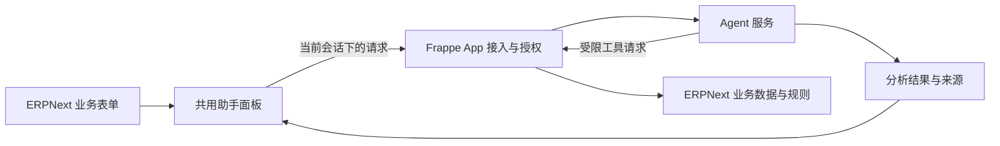

# ERPNext 页面内采购助手

本项目探索如何把 Agent 嵌入 ERPNext 的日常业务页面。用户处理单据时可以直接唤起助手，让它结合当前业务上下文查询、分析并给出建议。

当前仅保留方案说明，尚未初始化应用或接入 ERPNext。面向其他项目的需求文档不作为本项目的实施规格。以下是讨论方案，不代表全部选型已确定。

## 1. 想要的使用体验

以采购需求为例：用户打开一张需求单，点击页面上的“采购助手”，右侧展开对话面板，直接问“哪些供应商符合这次需求？”

助手知道正在查看哪张单据、关注哪些明细。结果留在当前页面中，列出候选供应商、匹配依据和待确认问题，用户可以边看需求边追问，也可以打开来源记录核实。

建议交互布局：

```text
┌──────────────────────────────────────────────────────────┐
│ 采购需求单                              [采购助手]        │
├─────────────────────────────────┬────────────────────────┤
│                                 │ 采购助手          [关闭]│
│ 需求基本信息                    │ 当前：需求单 XXX       │
│                                 │ 范围：全部 / 所选明细  │
│ 物料、规格、数量、期望日期       │                        │
│                                 │ [筛选供应商] [检查缺项]│
│ 原有业务操作                    │                        │
│                                 │ 候选、依据、待确认项  │
│                                 │                        │
│                                 │ 输入问题……      [发送]│
└─────────────────────────────────┴────────────────────────┘
```

首个入口建议放在采购用途的 Material Request 表单。ERPNext 官方采购流程以 Material Request 作为需求起点，并连接询价和后续采购单据；实际页面和字段仍需对照目标站点。[采购流程官方说明](https://docs.frappe.io/erpnext/procurement-cycle-overview)

## 2. 如何把入口放进 ERPNext

建议通过一个自定义 Frappe App 承载页面集成，在应用中统一维护按钮、面板和服务端接入逻辑。

Frappe 提供以下扩展点，可以作为实现基础：

| 扩展点                                        | 在本项目中的用途                               |
| --------------------------------------------- | ---------------------------------------------- |
| `doctype_js`                                  | 为指定单据表单附加脚本，注册该页面的助手入口   |
| `app_include_js` / `app_include_css`          | 在 Desk 加载共用面板资源，重内容按需要延迟加载 |
| 表单 `refresh` 事件与 `frm.add_custom_button` | 表单刷新时添加“采购助手”按钮                   |
| `frappe.call`                                 | 从页面调用自定义 App 中的服务端方法            |

这些是官方支持的脚本、资源加载和服务端调用能力。右侧助手面板、页面切换处理及 Agent 会话属于本项目需要实现的部分，不假定 ERPNext 已提供完整助手容器。[Hooks](https://docs.frappe.io/framework/user/en/python-api/hooks)、[Form API](https://docs.frappe.io/framework/user/en/api/form)、[Server Calls](https://docs.frappe.io/framework/user/en/api/server-calls)

Client Script 可用于快速验证一个页面按钮，正式代码建议收敛到自定义 App，便于统一发布和维护。该路径要求部署环境允许安装自定义 App；实施前先确认版本与部署限制。[Client Script](https://docs.frappe.io/framework/user/en/desk/scripting/client-script)

## 3. 页面集成与 Agent 的分工



建议保留独立 Agent 服务，但现阶段不锁定其框架和任务系统。各部分职责如下：

| 部分              | 职责                                                             |
| ----------------- | ---------------------------------------------------------------- |
| 页面适配          | 判断场景、读取当前单据定位信息和明细选择，提供快捷问题           |
| 共用面板          | 展示上下文、对话、结果和任务状态，处理打开、关闭与切换           |
| Frappe App 服务端 | 识别真实会话用户、检查访问权、读取正式数据、提供受控业务工具     |
| Agent 服务        | 理解问题、选择工具、组织分析和管理任务，不持有无限制业务访问权限 |

浏览器经 Frappe 同源接口发起任务，由服务端建立绑定用户、站点和单据范围的任务授权。Agent 后续查询也必须验证该授权和当前业务权限，不能信任浏览器或模型自行填写的用户 ID。身份委托的具体协议需要单独设计和验证。

耗时分析采用任务方式返回状态；首个原型可轮询，后续再决定流式输出方式。不要让页面的长时间等待阻断 ERPNext 原有操作。模型和服务凭证只保留在服务端。

## 4. 共用面板如何理解不同页面

每个页面提供一个明确的场景适配，面板和 Agent 服务共用。首个适配仅处理采购需求，其余随需求增加。

| 页面场景           | 带入的上下文                         | 可提供的快捷动作         |
| ------------------ | ------------------------------------ | ------------------------ |
| 采购需求           | 当前需求单、选中明细、修改标识       | 筛选供应商、检查需求缺项 |
| 供应商报价（后续） | 当前报价、关联需求、可访问的对比记录 | 解释报价、比较差异       |
| 采购订单（后续）   | 当前订单、选中明细                   | 查询交付、解释异常       |

页面传入的是单据定位和用户关注范围。已保存需求、供应商和历史记录由服务端按权限重新读取；不把整个页面 HTML 或所有字段无差别发送给模型。

面板始终显示当前关联单据。切换单据时切换上下文，旧请求的返回只进入原会话；单据修改后旧分析提示需要刷新。首个原型只处理已保存数据，遇到未保存修改时提示先保存。

## 5. 第一条 Agent 链路

先验证“当前采购需求 → 内部供应商分析”，将页面入口、数据授权和结果呈现串起来。

1. 用户在采购需求页打开面板，选择全部或部分明细，点击“筛选供应商”。
2. App 服务端验证身份与单据权限，读取正式需求，建立分析任务。
3. Agent 通过受控工具获取用户有权访问的供应商资料及相关历史记录。
4. 根据实际存在的数据比较物料、规格及其他明确条件，生成候选和来源。
5. 面板显示匹配依据、不满足项和待确认项，支持继续追问。

供应商数据能支持哪些判断，需要先检查实际站点。历史供货不代表当前有货或能保证本次交期；资料缺失时保留“待确认”。不以名称相似直接认定供货关系，不输出没有来源的资格、价格或承诺。

第一条链路只读。创建询价草稿等动作后续再讨论，届时需要预览确认、权限与版本校验、防重复和结果核实机制。

## 6. 下一步先确定什么

1. **环境**：ERPNext / Frappe 版本、部署位置、能否安装自定义 App，以及是否已有可用站点。
2. **页面**：实际采购需求是否使用 Material Request，是否存在定制字段和特殊流程。
3. **入口原型**：先验证表单按钮和右侧面板的布局、开关、页面切换，以及对原表单的影响。
4. **真实数据**：确认供应商与物料的关联、历史交易和权限是否足以支持第一条分析链路。
5. **Agent 接入**：再确定服务部署、模型、身份委托、任务状态和工具契约。

先在目标版本完成入口原型，再扩展多页面。仓库现阶段保留本说明和 AGENTS.md 开发约定，不预建服务目录或引入完整采购需求规格。
