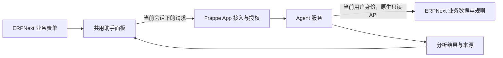

# ERPNext 页面内采购助手

本项目探索如何把 Agent 嵌入 ERPNext 的日常业务页面。用户处理单据时可以直接唤起助手，让它结合当前业务上下文查询、分析并给出建议。

当前已纳入 Docker 开发配置和官方 frappe_docker 子模块，已实现 Buying 常驻对话面板、独立 Agent 服务和只读 Item 工具；真实模型需在本地配置。面向其他项目的需求文档不作为本项目的实施规格。以下是讨论方案，不代表全部选型已确定。

## 1. 想要的使用体验

以采购需求为例：用户打开一张需求单，点击页面右下角的采购助手悬浮图标，右侧展开对话面板，直接问“哪些供应商符合这次需求？”

助手知道正在查看哪张单据、关注哪些明细。结果留在当前页面中，列出候选供应商、匹配依据和待确认问题，用户可以边看需求边追问，也可以打开来源记录核实。

建议交互布局：

```text
┌──────────────────────────────────────────────────────────┐
│ 采购需求单                              [采购助手]        │
├─────────────────────────────────┬────────────────────────┤
│                                 │ 采购助手          [关闭]│
│ 需求基本信息                    │ 当前：需求单 XXX       │
│                                 │ 范围：全部 / 所选明细  │
│ 物料、规格、数量、期望日期       │                        │
│                                 │ [筛选供应商] [检查缺项]│
│ 原有业务操作                    │                        │
│                                 │ 候选、依据、待确认项  │
│                                 │                        │
│                                 │ 输入问题……      [发送]│
└─────────────────────────────────┴────────────────────────┘
```

首个入口建议放在采购用途的 Material Request 表单。ERPNext 官方采购流程以 Material Request 作为需求起点，并连接询价和后续采购单据；实际页面和字段仍需对照目标站点。[采购流程官方说明](https://docs.frappe.io/erpnext/procurement-cycle-overview)

## 2. 如何把入口放进 ERPNext

建议通过一个自定义 Frappe App 承载页面集成，在应用中统一维护按钮、面板和服务端接入逻辑。

Frappe 提供以下扩展点，可以作为实现基础：

| 扩展点                                        | 在本项目中的用途                               |
| --------------------------------------------- | ---------------------------------------------- |
| `doctype_js`                                  | 为指定单据表单附加脚本，注册该页面的助手入口   |
| `app_include_js` / `app_include_css`          | 在 Desk 加载共用面板资源，重内容按需要延迟加载 |
| 表单 `refresh` 事件与 `frm.add_custom_button` | 表单刷新时添加“采购助手”按钮                   |
| `frappe.call`                                 | 从页面调用自定义 App 中的服务端方法            |

这些是官方支持的脚本、资源加载和服务端调用能力。右侧助手面板、页面切换处理及 Agent 会话属于本项目需要实现的部分，不假定 ERPNext 已提供完整助手容器。[Hooks](https://docs.frappe.io/framework/user/en/python-api/hooks)、[Form API](https://docs.frappe.io/framework/user/en/api/form)、[Server Calls](https://docs.frappe.io/framework/user/en/api/server-calls)

Client Script 可用于快速验证一个页面按钮，正式代码建议收敛到自定义 App，便于统一发布和维护。该路径要求部署环境允许安装自定义 App；实施前先确认版本与部署限制。[Client Script](https://docs.frappe.io/framework/user/en/desk/scripting/client-script)

## 3. 页面集成与 Agent 的分工



建议保留独立 Agent 服务，但现阶段不锁定其框架和任务系统。各部分职责如下：

| 部分              | 职责                                                             |
| ----------------- | ---------------------------------------------------------------- |
| 页面适配          | 判断场景、读取当前单据定位信息和明细选择，提供快捷问题           |
| 共用面板          | 展示上下文、对话、结果和任务状态，处理打开、关闭与切换           |
| Frappe App 服务端 | 验证当前登录用户，将聊天请求接入 Agent；仅按需补充原生 API 缺失能力 |
| Agent 服务        | 理解问题、选择工具、组织分析和管理任务，不持有无限制业务访问权限 |

浏览器通过 Frappe 同源接口 `procurement_assistant.api.chat` 发送问题。当前开发版只支持现有站点的浏览器登录会话：Frappe 服务端将会话凭证交给同机运行的 Agent，Agent 调用原生登录身份接口核实用户，并携同一会话调用 Item API。会话只在本轮请求内使用，不写日志、不传给模型、不在 Agent 中持久化。Agent 仅监听宿主机 Docker 网桥地址的 8100 端口，Frappe 通过 host.docker.internal 连接。

这是一种开发环境下的会话委托，凭证本身仍具有用户原有权限，尚未实现 OAuth 或细粒度短期授权。当前 Agent 只提供固定 Item 只读工具，不能自选站点、任意 API 或写动作。后续生产接入需设计正式的委托与撤销机制。

当前聊天采用同步请求，一次只执行一个问题；工具调用和超时有上限。前端显示等待和失败状态，对话暂存于浏览器内存并按用户与页面隔离，刷新后清空，不代表已经实现持久任务或长期记忆。

## 4. 共用面板如何理解不同页面

每个页面提供一个明确的场景适配，面板和 Agent 服务共用。首个适配仅处理采购需求，其余随需求增加。

| 页面场景           | 带入的上下文                         | 可提供的快捷动作         |
| ------------------ | ------------------------------------ | ------------------------ |
| 采购需求           | 当前需求单、选中明细、修改标识       | 筛选供应商、检查需求缺项 |
| 供应商报价（后续） | 当前报价、关联需求、可访问的对比记录 | 解释报价、比较差异       |
| 采购订单（后续）   | 当前订单、选中明细                   | 查询交付、解释异常       |

页面传入的是单据定位和用户关注范围。已保存需求、供应商和历史记录由服务端按权限重新读取；不把整个页面 HTML 或所有字段无差别发送给模型。

面板始终显示当前关联单据。切换单据时切换上下文，旧请求的返回只进入原会话；单据修改后旧分析提示需要刷新。首个原型只处理已保存数据，遇到未保存修改时提示先保存。

## 5. 第一条 Agent 链路

先验证“当前采购需求 → 内部供应商分析”，将页面入口、数据授权和结果呈现串起来。

1. 用户在采购需求页打开面板，选择全部或部分明细，点击“筛选供应商”。
2. App 服务端验证身份与单据权限，读取正式需求，建立分析任务。
3. Agent 通过受控工具获取用户有权访问的供应商资料及相关历史记录。
4. 根据实际存在的数据比较物料、规格及其他明确条件，生成候选和来源。
5. 面板显示匹配依据、不满足项和待确认项，支持继续追问。

供应商数据能支持哪些判断，需要先检查实际站点。历史供货不代表当前有货或能保证本次交期；资料缺失时保留“待确认”。不以名称相似直接认定供货关系，不输出没有来源的资格、价格或承诺。

第一条链路只读。创建询价草稿等动作后续再讨论，届时需要预览确认、权限与版本校验、防重复和结果核实机制。

## 6. 下一步先确定什么

1. **环境**：ERPNext / Frappe 版本、部署位置、能否安装自定义 App，以及是否已有可用站点。
2. **页面**：实际采购需求是否使用 Material Request，是否存在定制字段和特殊流程。
3. **入口原型**：先验证表单按钮和右侧面板的布局、开关、页面切换，以及对原表单的影响。
4. **真实数据**：确认供应商与物料的关联、历史交易和权限是否足以支持第一条分析链路。
5. **Agent 接入**：再确定服务部署、模型、身份委托、任务状态和工具契约。

先在目标版本完成入口原型，再扩展多页面。仓库维护方案、开发约定和开发环境配置，后续按需要创建 App 与 Agent 源码。


## 7. Docker 开发环境

官方仓库作为 `frappe_docker/` Git 子模块固定版本，我们的开发配置和启动脚本位于 `devcontainer/`。在项目根目录执行：

```bash
git submodule update --init --recursive
docker compose -f devcontainer/docker-compose.yml up -d
docker compose -f devcontainer/docker-compose.yml logs -f frappe
```

Compose 项目名固定为 `erpnext-dev`。启动脚本等待数据库和 Redis 健康后，首次自动创建 version-16 Bench、安装 ERPNext 并创建 `development.localhost` 站点；已有完整环境直接启动 `bench start`，无需手动进入容器。首次下载、依赖安装和资源构建需要时间，容器运行不表示初始化已完成，请查看日志。

访问 http://development.localhost:8000 ，本机开发账号为 `Administrator`，首次密码为 `admin`。已有站点的密码不重置。端口 8000 和 9000 仅发布到本机。

整个项目挂载到 `/workspace`，保留子模块与主仓库 `.git/modules/` 的相对位置。Bench 位于 `/workspace/frappe_docker/development/frappe-bench`。调试时进入：

```bash
docker compose -f devcontainer/docker-compose.yml exec --user frappe frappe bash
cd /workspace/frappe_docker/development/frappe-bench
```

停止环境执行 `docker compose -f devcontainer/docker-compose.yml down`，再次 `up -d` 即可启动；不要加 `-v`，否则会删除数据库卷。首次采用自动启动配置时先停止原终端中的 `bench start`，再执行 `up -d`，Compose 会重建配置变化的容器。

初始化失败会退出并保留现场，不自动删除或覆盖数据。未完成的初始化会留下 `frappe_docker/development/.procurement-initializing` 标记；需要检查日志和修复环境后再移除该标记重试。已有 Bench 不完整、站点数据库缺失或 ERPNext 未安装时也会报错，不以目录存在作为成功依据。启动脚本不自动升级或迁移现有应用。

另一台设备首次克隆使用 `git clone --recurse-submodules <项目仓库地址>`；已有仓库执行 `git pull` 和 `git submodule update --init --recursive` 后再启动。每台设备的数据库和站点独立初始化。

`frappe_docker/development/frappe-bench/` 和初始化标记由上游忽略规则排除，数据库保存在 Docker 命名卷中，均不随主仓库同步。自己的 App 源码后续放在主仓库管理并配置挂载，不仅保存在被忽略的 Bench 目录中。官方子模块内不维护定制，开发配置统一提交到 `devcontainer/`。


## 8. 对话助手与 Item 工具

- `frappe_app/`：Buying 内常驻的对话面板，以及 Frappe 登录会话接入接口。
- `assistant/server.py`：独立 Agent HTTP 服务，使用支持 Chat Completions 函数工具调用的模型接口。
- `query_items(query, offset=0, limit=10)`：Agent 侧工具，通过 ERPNext 原生 `GET /api/resource/Item` 查询，不重建查询业务接口。

进入 Buying 任意页面，点击右下角图标发送“列出前 5 个物料”或“查询名称包含螺丝的 Item”。工具只返回当前用户有权访问的编码、名称、物料组、单位和停用状态，最多每页 20 条，明确是否还有下一页。含 `%`、`_` 或反斜杠的关键词按完整编码或名称精确查询，避免将编码中的通配符当作模糊匹配。

回复下方显示真实工具查询结果的物料链接。模型不能查询库存或价格，也不能创建、修改、提交单据。当前页面只用于前端标识和会话隔离，不自动读取单据正文；需要用户输入物料关键词或编码。

支持连续追问、清空对话、Enter 发送和 Shift+Enter 换行。关闭面板后本轮请求继续，结果仍归属原页面；切换页面不会把旧响应显示在新页面。最近最多 20 条已完成消息用于后续推理，历史仅保存在当前浏览器内存。

### 配置模型

复制 `assistant/.env.example` 为 `assistant/.env`，填写：

```dotenv
LLM_BASE_URL=https://你的模型服务地址/v1
LLM_MODEL=支持工具调用的模型名
LLM_API_KEY=你的密钥
```

`assistant/.env` 已被 Git 忽略，不要提交密钥。也支持不需要密钥的本地兼容服务；Agent 在本机运行，可直接使用本机模型的 localhost 地址。

在项目根目录执行：

```bash
docker compose -f devcontainer/docker-compose.yml up -d
uv run --project assistant python assistant/server.py
```

未配置模型时服务仍可启动，发送消息会明确提示配置缺失，不会生成模拟 AI 结果。健康检查表示 HTTP 服务运行，不表示模型已可用。配置真实模型后，用户问题、最近对话和工具返回的 Item 字段会发往该模型服务，登录凭证不会发送。

### 开发与验证

App 由 Bench 软链接引用主仓库源码，启动时自动安装并构建。前端更新后可运行：

```bash
docker compose -f devcontainer/docker-compose.yml exec -T frappe bash /workspace/devcontainer/install-app.sh
```

Assistant 使用 FastAPI 提供 `/health` 和 `/chat`，Uvicorn 运行 ASGI 服务；现有同步模型和 ERPNext 查询在线程池执行，不阻塞事件循环。请求由 Pydantic 校验，错误不回显会话凭证。Agent 仍在宿主机运行，不加入 Docker Compose。

使用 uv 管理 Python 3.13 和依赖，在 `assistant/` 中执行：

```bash
uv sync
uv run python server.py
```

`server.py` 自动读取同目录 `.env`，已有环境变量优先；未设置 `AGENT_HOST` 时读取 Docker bridge 网关并仅绑定该地址。无法确定网桥时明确报错，可手动设置容器可达的 `AGENT_HOST`。Frappe 通过 `PROCUREMENT_AGENT_URL`（默认 `http://host.docker.internal:8100`）访问 Agent，Agent 通过 `ERPNEXT_URL`（默认 `http://127.0.0.1:8000`）访问 ERPNext。

修改代码或模型配置后重新运行服务，Ctrl+C 停止。远程 Docker 或 Docker Desktop 场景需按实际网络配置地址。Agent 未启动时 ERPNext 仍可使用，聊天提示服务不可用。

开发依赖包含 Pyright 和 Ruff，执行 `uv run pyright`、`uv run ruff check .`。Python 版本范围为 `>=3.13,<3.14`，提交 `uv.lock` 保持依赖一致。
