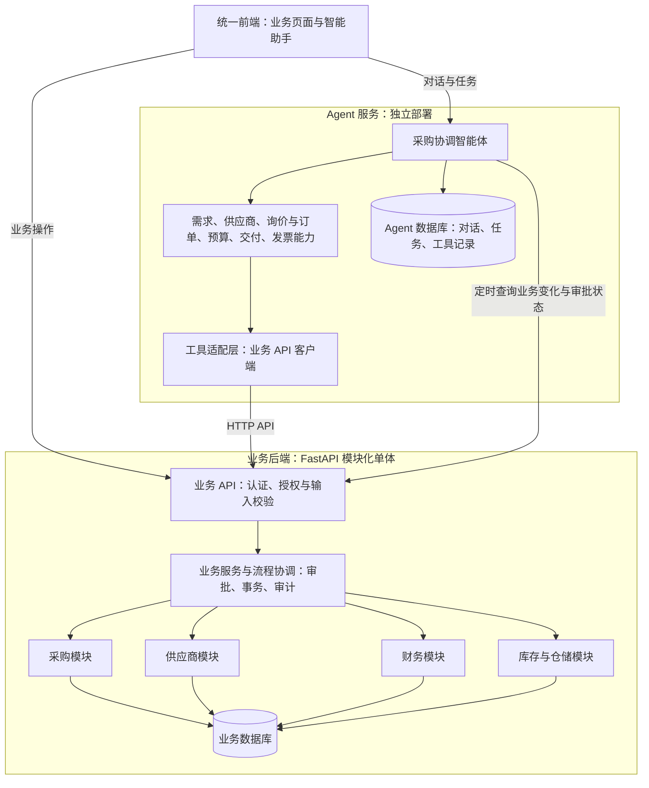

# 采购智能体系统产品与架构设计方案

## 1. 建设目标与范围

本项目从零建设采购业务平台和独立的 Agent 服务。当前没有可对接的业务系统，需要同时建设正式业务数据、人工操作页面和业务接口，再逐步加入智能辅助能力。

业务平台内部采用模块化单体，包含四个业务模块；Agent 服务独立开发、部署，通过业务 API 查询和执行操作。

| 自建业务模块 | 首期建设内容 | 智能体主要用途 |
|---|---|---|
| 采购管理 | 申请与任务分配、寻源与授予、合同协议、订单、履约及变更 | 需求检查、询价比价、采购流程辅助 |
| 供应商管理 | 档案、供货品类、准入审批、启用停用、基础绩效 | 候选推荐、准入状态与绩效分析 |
| 财务管理 | 预算与占用、履约发票匹配、付款申请授权及实付登记 | 预算分析、发票差异解释、付款状态查询 |
| 库存与仓储 | 物料、仓库、期初库存、入出库流水、收货、退货 | 库存参考、采购需求和交付分析 |

正式业务记录与审批由业务后端管理，Agent 服务保存对话、任务和分析记录。业务平台在 Agent 服务不可用时仍能完成人工采购流程。

财务模块首期定位为采购预算与应付管理，不建设完整会计核算或银行支付系统；付款状态来自财务人员登记及凭证。库存必须记录出入库与调整，不能只累计采购收货。

采购流程参考 IBM TRIRIGA 11.6，支持协议下单、RFQ、RFP 和招标分支，合同、协议和变更由采购模块管理，按业务切片实施。签署与供应商往来首期在线下完成并登记凭证。不建设独立合同、邮件或办公系统，不接入外部供应商及市场数据源；自动合同审查、自动续签、舆情监控、市场价格预测和自动谈判不纳入本期范围。详细来源及本地化决定见[采购流程与业务动作设计](platform/docs/PROCUREMENT.md)。

## 2. 产品形态

业务平台支持多公司、多币种及实物、服务、许可和订阅采购，提供一个采购智能助手入口，按用户、组织和角色控制数据与操作权限。统一前端提供采购业务页面和智能助手，分别访问业务后端与 Agent 服务。

| 产品能力 | 主要内容 |
|---|---|
| 统一采购助手 | 自然语言查询、发起分析、生成申请或询价草稿 |
| 任务详情 | 展示关联单据、分析依据、执行状态和待处理问题 |
| 智能待办 | 汇总信息缺失、超预算、待审批、交付逾期、发票差异等事项，链接至业务页面处理 |
| 每日简报 | 汇总待处理申请、临近截止的询价、未完成订单和发票异常 |

典型请求：

- 这批物料库存是否足够，还需要采购多少？
- 从已准入供应商中推荐满足这次需求的候选名单。
- 比较这三家报价，并对比历史采购价格。
- 哪些订单已经到期但尚未收齐？
- 这张发票与订单、收货记录有哪些差异？

提醒和简报首先展示在智能体工作台，不依赖邮件、即时通信或额外办公平台。

## 3. 总体架构与技术选型

### 3.1 两个独立后端

采用“独立 Agent 服务 + 包含四个模块的业务后端”。业务后端内部不拆成四个微服务；Agent 服务内部包含一个采购协调智能体和六类专业能力，不按智能体分别部署。



| 边界 | Agent 服务 | 业务后端 |
|---|---|---|
| 职责 | 意图理解、任务拆解、模型调用、建议、工具编排 | 正式单据、业务规则、审批、权限、事务、业务审计 |
| 数据 | 对话、任务状态、分析结果、工具执行记录 | 四个模块的正式业务数据与审批记录 |
| 调用方式 | 只通过业务 API 访问业务能力 | 不依赖 Agent 完成正常人工业务 |
| 状态管理 | 等待审批、重试、任务恢复 | 审批是否通过、单据是否合法、操作是否生效 |
| 部署 | 独立进程、镜像、依赖与发布 | 四个模块统一部署，可独立于 Agent 发布 |

Agent 数据库与业务数据库使用不同账号，互不授权访问。试点可共用一个 PostgreSQL 实例中的两个数据库，后续可分别部署。Agent 不导入业务 ORM 模型、不直连业务数据库；分析快照标注来源和时间，不作为正式状态。

### 3.2 技术栈与代码组织

已确定后端语言为 Python、接口框架为 FastAPI。配套建议如下，具体版本在实施时锁定：

| 部分 | 技术选择 |
|---|---|
| 统一前端 | TypeScript + React |
| 两个后端的 API | Python + FastAPI + Pydantic |
| 数据访问与迁移 | SQLAlchemy + Alembic，各服务独立维护迁移 |
| 数据库 | PostgreSQL，业务库与 Agent 库隔离 |
| Agent 耗时任务 | Celery + Redis，任务执行器与 Agent API 共用服务代码 |
| 开发与试点部署 | Docker Compose，两个后端独立构建与启动 |

初期使用一个仓库管理，目录区分服务；代码仓库统一不影响服务独立发布。共享内容限于 API 契约和生成的客户端，不共享数据库模型或内部业务实现。

以下为规划结构，目前已创建三个根目录及说明文档，内部应用目录在初始化时建立。

```text
web/                        # 业务页面与智能助手
platform/                   # 独立业务平台后端
  src/procurement_platform/
    core/                   # 配置、数据库、日志与错误处理
    foundation/             # 用户、组织、权限、主数据、附件、审计
    procurement/
    suppliers/
    finance/
    inventory/
    approvals/              # 审批规则、实例、节点与决策
    workflows/              # 跨模块事务协调
    integrations/           # 助手授权接入、幂等与业务变化
  migrations/
  tests/
  docs/DESIGN.md            # 业务平台详细设计
  docs/DATABASE.md          # 逐表数据库详细设计
assistant/                  # 独立智能助手服务
  app/
    api/                    # 对话与任务接口
    agents/                 # 协调与专业能力
    tools/                  # 受控业务 API 适配
    tasks/                  # 任务编排、等待、重试与恢复
  migrations/
  tests/
contracts/                  # 业务 API 契约
```

### 3.3 业务规则归属

业务平台的数据模型、状态流转、API 和验收规则见[采购业务平台详细设计](platform/docs/DESIGN.md)。

四个业务模块各自管理所属表，通过业务服务协作。跨模块操作由业务流程层协调，例如批准订单时检查供应商状态、占用预算并更新订单，相关写入在业务数据库同一事务内完成。

前端和 Agent 调用同一套业务规则。预算智能体提供解释和建议，预算余额计算及占用由财务模块负责；发票智能体解释差异，正式匹配结果由业务后端按确定性规则计算和记录。

采购协调智能体负责安排任务顺序、汇总结果并在审批或异常处暂停。审批结果由业务后端确认，通过后再恢复任务。模型调用在业务数据库事务之外执行，提交动作时重新检查权限、单据版本和业务状态。

## 4. 业务智能体职责

| 智能体 | 核心职责 | 使用系统 | 主要输出 |
|---|---|---|---|
| 需求智能体 | 提取物料、规格、数量、交期等信息；检查缺项、重复申请和库存；按采购规则提出流程建议 | 采购、库存与仓储 | 结构化需求、补充信息清单、建议采购量、申请草稿 |
| 供应商智能体 | 在内部供应商库中筛选；核验准入状态；结合已有绩效和交易记录推荐供应商 | 供应商、采购 | 候选名单、推荐依据、准入或绩效问题提示 |
| 询价与订单智能体 | 生成询价草稿、跟踪报价、统一比价、对比历史价格；根据审批结果准备订单 | 采购、供应商 | 询价草稿、比价表、定标建议、订单草稿 |
| 预算智能体 | 按组织和预算科目查询可用预算，与预计采购金额比较 | 财务、采购 | 预算校验结果、超预算差额、处理建议 |
| 交付智能体 | 对比订单约定交期与累计收货，识别临期、逾期和未收齐订单 | 采购、库存与仓储 | 交付状态、异常清单、催交建议 |
| 发票智能体 | 核对订单、收货和发票；识别数量、金额、税率差异；查询付款状态 | 财务、采购、库存与仓储 | 三单匹配结果、差异明细、付款状态 |

能力边界：

- 供应商推荐限于内部已有资料；准入由供应商管理系统审批，智能体不自行批准或解禁供应商。
- 比价基于采购系统报价和历史成交数据，明确税费、运费、币种和单位口径。信息缺失或口径不一致时提示补充，不直接给出确定排名。
- 库存仅作为需求核实参考；申请采购数量是否调整由采购员与申请人确认，助手不得自动扣减数量或改为领用。
- 预算查询不等于预算占用。提交采购审批或订单前应重新校验，预算控制以财务系统规则为准。
- 交付判断基于订单和收货记录，不推断没有数据支持的生产进度、物流位置或预计到货时间。
- 发票匹配按订单行关联累计收货和已开票数量，考虑分批收货、分次开票和退货。缺少关联信息时转人工核实；匹配通过不代表批准付款。

## 5. 核心业务流程

采购主流程按[平台 README](platform/README.md#逐步执行流程)的角色动作执行：提出需求、分配采购员、申请审批、选择采购方式、形成合同或订单、履约验收、发票核对、付款申请与授权、实际付款登记及收尾。

协议下单跳过本轮竞争寻源；RFQ 将询价与报价分开；RFP 和招标分别记录征集文件、响应、评审与授予。合同与订单按执行模式确定唯一预算承诺，实物与非实物分别使用收货和业务验收依据。

助手可辅助需求检查、内部供应商推荐、响应比较、异常解释及草稿准备。审批、合同签署、正式验收、支付授权和财务复核由授权人员完成；助手不可用时，人工仍可完整执行。供应商首期线下参与，由采购员登记往来和原始凭证。

业务对象、状态、配套动作和实施顺序见[采购流程与业务动作设计](platform/docs/PROCUREMENT.md)。平台字段字典仍为待重构的 v1 草案，新增业务不代表已经实现。

## 6. 服务间接口与执行边界

### 6.1 业务能力接口

业务后端先实现四个模块的人工作业能力，再向 Agent 开放受控 API。下表的操作范围是 Agent 的权限，不限制业务人员在相应模块的正常操作。

| 模块 | Agent 查询内容 | 首期允许的 Agent 操作 |
|---|---|---|
| 采购 | 申请、报价、订单、审批状态、历史价格 | 创建申请、询价和订单草稿；按用户授权提交审批；经审批及权限校验执行发布动作 |
| 供应商 | 档案、供货范围、准入状态、基础绩效 | 只读；资料维护和准入审批由业务人员完成 |
| 财务 | 预算余额、发票、匹配结果、付款状态 | 查询及请求规则匹配；预算占用由正式业务流程触发，不开放直接改余额或付款的工具 |
| 库存与仓储 | 库存可用量、收货和退货记录 | 只读；出入库和调整由业务人员完成 |

接口按业务动作设计，例如创建订单草稿、提交审批、查询审批结果，不向 Agent 开放任意 SQL 或任意字段修改接口。API 使用版本化路径，明确请求、响应、错误码、幂等键和单据版本；开发阶段变更同步更新所有调用方并执行接口契约检查，不保留旧接口别名或转发兼容层。

### 6.2 身份、审批与可靠执行

- **身份与授权**：业务后端统一管理用户和组织权限。Agent 使用服务身份及可验证的用户委托凭证调用；业务后端校验签名、有效期、目标服务、权限范围和当前用户权限，不信任请求体中自行填写的用户 ID 或角色。定时任务使用权限受限的服务身份。
- **审批边界**：聊天中的确认可以授权创建草稿或提交申请，不能替代正式业务审批。审批绑定单据版本；关键内容变化后重新校验。Agent 只能查询审批结果，不能把审批字段改为通过。
- **幂等与超时**：写操作携带幂等键，业务后端记录请求摘要与结果，同键不同内容拒绝执行。超时后用同键查询或重试确认结果，Agent 记录暂时未知状态，不能直接认定失败后重新建单。
- **事务边界**：一次正式业务动作由业务后端完成校验和事务提交。多个 API 调用不构成一个数据库事务；Agent 按业务单据记录进度，取消或撤销通过业务接口执行，不能跨服务直接回滚数据。
- **状态恢复**：Agent 数据库保存任务步骤和关联单据。业务操作已成功但 Agent 保存结果失败时，通过幂等键和业务状态恢复；业务平台不等待 Agent 成功落库才能完成操作。
- **审计关联**：服务间携带任务 ID 和请求追踪 ID；业务后端记录实际调用者、委托用户、审批依据和执行结果，Agent 记录工具输入输出并控制敏感信息留存。

### 6.3 业务变化触发

首期 Agent 定时调用业务变化查询接口，以持久化游标增量获取申请、报价、审批和收货等变化，并按变化 ID 去重；人工发起任务直接查询最新单据。待审批任务同样通过接口恢复，不占用长时间数据库事务。

业务变化与单据写入同事务保存，后台发布器为已提交变化分配稳定发布游标供 Agent 拉取，具体规则见业务平台详细设计。需要实时推送时再接入消息队列；投递允许重试，消费必须幂等，正式执行前仍查询和校验业务状态。

## 7. 数据与公共能力

### 7.1 数据来源与关联

| 数据类别 | 权威来源 | 关联要求 |
|---|---|---|
| 采购申请、报价、订单、采购审批 | 采购管理系统 | 保留单据编号、行号、版本和审批状态 |
| 供应商主数据与准入、绩效 | 供应商管理系统 | 使用供应商编码，四个模块共用同一标识 |
| 预算、发票、付款状态 | 财务系统 | 关联组织、预算科目、供应商、订单及明细 |
| 库存、收货与退货 | 库存与仓储系统 | 关联物料、仓库、订单及明细 |
| 采购制度、阈值、操作说明 | 管理员维护的内部知识与规则 | 标注版本、生效时间及适用组织 |

统一物料编码、供应商编码、计量单位、币种和含税口径。无法可靠关联的数据保留为待核实项，不以名称相似直接完成业务匹配。分析结果注明来源单据和查询时间，历史缓存不覆盖业务后端数据。

### 7.2 任务、权限与审计

- **任务状态**：待执行、执行中、待人工处理、待审批、已完成、失败、已取消；保留关联单据及执行记录，支持中断后继续。
- **访问权限**：每次执行携带用户、角色、组织和数据范围；后台定时任务使用明确授权的服务身份和业务范围。
- **人工控制**：自动查询、规则检查和分析可直接执行；询价发布、定标、正式下单等动作需按业务后端权限与审批规则执行。首期不由 Agent 自动改动库存、收货、发票登记或付款登记。
- **操作可靠性**：重复事件和重试使用幂等标识；写入超时先核查业务后端是否成功，避免重复创建申请、询价或订单。
- **结果可追溯**：记录数据来源、规则版本、建议、审批人和接口结果。金额计算及匹配使用确定性规则，智能体负责解释与建议；规则缺失或数据不足时明确标记无法判断。

## 8. 分阶段建设与验收

### 第一阶段：业务基础与人工闭环

建设业务后端、业务前端及用户、组织、权限、审计基础，完成供应商档案与准入、预算与占用、采购申请与审批、报价录入、订单、出入库及收退货、发票匹配、付款登记的最小功能。

验收场景：关闭 Agent 服务后，采购人员仍能完成一笔采购；并发占用不能超预算，重复提交不能重复建单，退回或修改单据后审批状态正确，库存和金额均有流水可查。

### 第二阶段：独立 Agent 服务接入

建设 Agent API、独立数据库、工具适配层和任务执行器。优先交付需求检查、供应商推荐、报价分析，再增加预算解释、交付跟踪和发票差异解释。先只读分析，再开放草稿创建和提交审批。

验收场景：每个分析结果可追溯至业务单据；Agent 无业务库访问凭证；越权操作被业务 API 拒绝；审批未通过不执行后续正式动作；接口超时和 Agent 重启后能核实结果并恢复任务，不重复建单。

### 第三阶段：跨步骤协调与持续优化

在同样两个服务和四个业务模块上增加审批后恢复、定时巡检、采购简报、供应商绩效趋势和周期分析，按实际需要引入事件推送。

验收场景：完整任务经过人工审批后继续，修改单据会重新校验，异常任务可由人工接管；Agent 单独发布或停止不影响业务平台使用。

## 9. 效果指标

| 方向 | 指标 |
|---|---|
| 效率 | 申请检查耗时、询价准备耗时、报价整理耗时、发票核对耗时 |
| 质量 | 需求信息完整率、比价准确率、三单匹配准确率、建议采纳率 |
| 流程 | 审批等待时长、订单逾期率、异常关闭时长 |
| 系统运行 | 接口调用成功率、任务完成率、人工接管率、重复单据数量 |

上线前记录人工处理基线，试点期间按同类采购场景比较。每阶段优先验证数据可用、流程可执行、结果可追溯，再扩大自动化范围。
