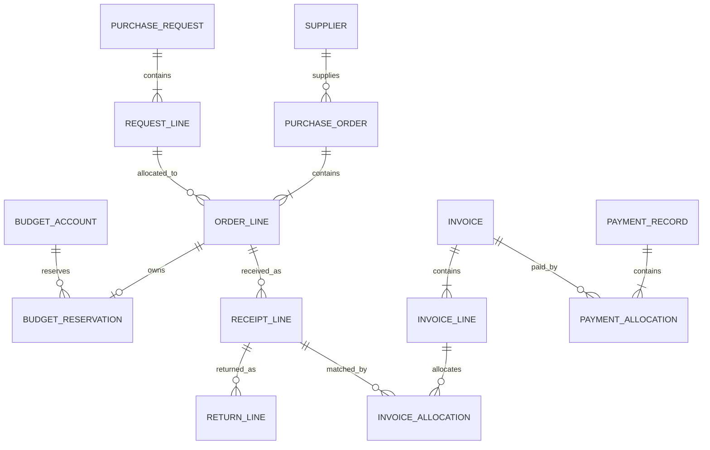

# 采购业务平台详细设计

版本：设计草案 v3；日期：2026-09-08；状态：已按 IBM 参考调整业务基线，平台尚未实现。

业务流程、对象及新增动作以[采购流程与业务动作设计](PROCUREMENT.md)为准。本文的数据库目录、已有接口和并发示例仍包含 v1 普通订单切片；合同、非实物履约、征集类型和付款授权须按该业务基线同步重构，不能将现有表和接口目录视为完整实现规格。

## 1. 定位、范围与默认口径

`platform/` 是独立部署的采购业务后端，使用 Python + FastAPI，内部采用模块化单体。采购、供应商、财务、库存四个模块共用一个业务数据库，通过模块服务和流程协调协作。`assistant/` 独立部署、使用独立数据库，只通过业务 API 访问平台。`web/` 提供业务操作页面和助手入口。

平台必须在助手停止运行时，仍支持人工完成供应商准入、申请审批、询价比价、订单、收货、发票核对和付款登记。

以下为目标范围与实施边界；多公司、多币种和非实物采购已确定，具体公司制度仍需配置：

| 项目 | 目标范围 | 实施边界 |
| ---- | -------- | -------- |
| 组织 | 多公司、多部门；公司限定数据权限、准入、预算及结算 | 不跨公司合并采购单据 |
| 币种 | 交易币种、预算币种、本位币及汇率快照 | 首批普通付款同应付币种；跨币种结算另补差额规则 |
| 采购对象 | 实物、服务、软件许可与订阅；按数量或金额验收 | 非实物不强制物料编码和仓库 |
| 寻源 | 协议下单、RFQ、RFP、招标及有审批依据的例外 | 首期供应商线下交互；各方式按业务切片交付 |
| 合同与订单 | 协议下单或合同直接履约；审批、签署、下达和变更分别留痕 | 合同在采购模块，不建设独立合同服务 |
| 审批 | 按公司、类别、金额和动作配置固定顺序节点 | 会签、加签和可视化设计器后续扩展 |
| 预算 | 明细支持预算分配；申请审批通过建立预占，订单批准或直接履约合同生效转承诺占用（多退少补） | 同一采购义务不得在合同和订单重复占用 |
| 发票与付款 | 履约匹配、应付、付款申请、授权、实付登记与复核 | 不建设银行支付、税务查验和完整会计核算 |
| 仓储 | 实物收退货、领用、盘点及库存流水 | 不允许负库存；非实物验收归采购模块 |

最低询价家数、审批金额阈值、交付提醒提前天数、发票舍入容差均为配置项，不在代码中写死。规则缺失时阻止相关提交并提示配置问题。付款登记不代表平台发起了银行付款，发票核对不代表税务真伪验证。

## 2. 用户、工作台与页面

### 2.1 角色与责任

| 角色          | 主要操作                                             | 主要数据范围                       |
| ------------- | ---------------------------------------------------- | ---------------------------------- |
| 申请人        | 新建需求、提交申请、补充资料、查看进度               | 本人单据及获授权的部门数据         |
| 采购员        | 供应商查询、询价发布、密封响应盲收登记、参与开标、定标建议、订单与催交待办 | 分配的组织和采购单据               |
| 监标人/开标见证人 | 截标后开标授权与监督、见证集中解密与开标记录生成     | 负责的招标或询价征集单据           |
| 采购负责人    | 申请、定标、订单审批；异常决策                       | 获授权组织                         |
| 供应商管理员  | 档案、资质资料、准入申请与状态维护                   | 获授权供应商范围                   |
| 仓管员        | 收货、退货、领用、盘点调整                           | 获授权仓库                         |
| 财务人员      | 预算维护申请、发票核对、付款登记                     | 获授权法人、部门与预算项           |
| 审批人/复核人 | 完成分配给自己的审批或复核                           | 对应待办关联单据的必要字段         |
| 系统管理员    | 账号、权限、规则、基础配置                           | 配置管理；不自动获得所有业务审批权 |
| 助手服务      | 授权查询、草稿创建、提交审批、获准的业务动作         | 用户委托权限与工具权限的交集       |

同一人可以有多个角色，但本人提交的申请、定标、订单、预算调整、库存调整和付款登记不能由本人完成最终审批；开标解密必须由监标人（或系统自动集中开标）见证，采购员不可单人私下拆封。试点数据中至少准备两名可相互复核的人员；没有合格审批人时停留待处理，不能自动通过。

### 2.2 页面清单

| 导航       | 列表与详情                                   | 关键操作                         |
| ---------- | -------------------------------------------- | -------------------------------- |
| 工作台     | 我的待办、申请进度、未收齐订单、发票异常     | 跳转单据、处理审批               |
| 采购管理   | 采购申请、询价单、报价对比、定标单、采购订单 | 草稿编辑、提交、发布、取消剩余量 |
| 供应商管理 | 档案、准入申请、资质、基础绩效               | 建档、送审、停用与恢复申请       |
| 财务管理   | 预算余额和流水、发票、匹配差异、付款记录     | 预算调整、提交匹配复核、登记付款 |
| 库存与仓储 | 库存余额、流水、收货、退货、领用、盘点调整   | 过账、查看来源、冲销错误记录     |
| 平台设置   | 组织、用户、角色、物料、仓库、审批规则       | 维护主数据、配置流程             |
| 审计与集成 | 操作记录、接口请求、事件投递状态             | 按单据或追踪 ID 查询             |

单据详情统一展示：编号与版本、业务状态、明细、关联单据、附件、审批轨迹、操作历史及当前可执行动作。前端按钮根据权限和状态显示，后端每次仍独立校验。预算不足等错误提供差额和下一步处理入口。

## 3. 模块边界与工程结构

### 3.1 模块职责

| 模块           | 拥有的数据和规则                                   | 对外服务示例                         |
| -------------- | -------------------------------------------------- | ------------------------------------ |
| `foundation`   | 用户、组织、角色、物料、单位、仓库定义、附件、审计 | 授权校验、主数据查询、单据登记       |
| `suppliers`    | 档案、供货品类、资质、准入与运营状态、绩效快照     | 检查可采购状态、候选查询             |
| `procurement`  | 申请、任务、征集响应、授予、合同订单、变更及非实物验收         | 创建订单草稿、检查可收货数量         |
| `finance`      | 预算与分配、发票应付、付款申请授权及实付登记       | 占用/释放预算、核对发票、登记付款    |
| `inventory`    | 收退货单、出入库单、库存余额与流水                 | 收货过账、退货过账、库存查询         |
| `approvals`    | 审批规则版本、审批实例、节点和决策记录             | 创建审批、校验当前审批人、记录决策   |
| `workflows`    | 跨模块动作与事务协调，不复制模块账本               | 完成订单审批、收货过账、取消订单余量 |
| `integrations` | 助手授权接入、幂等记录、变化记录和发布游标         | 查询操作结果、拉取业务变化           |

模块内部可使用所属 ORM 模型；跨模块通过公开服务交换明确的输入输出结构。跨模块只读报表可使用显式查询服务关联表，禁止通过报表路径修改其他模块数据。前端和助手共用同一业务动作。

### 3.2 规划目录

```text
platform/
  pyproject.toml
  src/
    procurement_platform/
      main.py
      core/                 # 配置、数据库会话、日志、错误处理
      foundation/
      suppliers/
      procurement/
      finance/
      inventory/
      approvals/
      workflows/
      integrations/
  migrations/
  tests/
    unit/
    integration/
    contract/
    acceptance/
  docs/
    DESIGN.md
    PROCUREMENT.md          # 流程、对象及业务动作基线
    DATABASE.md             # 逐表字段、约束与索引
```

`platform/` 仅作项目目录，Python 包名使用 `procurement_platform`，避免与标准库 `platform` 重名。每个业务模块先使用 `router.py`、`schemas.py`、`models.py`、`service.py` 和必要的 `queries.py`；复杂后按业务对象拆分，不先搭建通用 CRUD 框架。

路由处理协议、身份和输入输出，服务处理业务规则，顶层用例管理事务，查询函数处理列表与报表。FastAPI 使用 `APIRouter` 组织模块并统一注册依赖。[FastAPI 多模块组织文档](https://fastapi.tiangolo.com/tutorial/bigger-applications/)

### 3.3 数据访问与运行方式

使用 SQLAlchemy + PostgreSQL，Alembic 管理迁移。首期选择同步数据库访问和同步业务路由，保持事务代码直接可读；每个请求或后台任务独立创建 Session，同一次跨模块用例传递同一个 Session，内部服务不得自行提交。SQLAlchemy Session 不跨并发线程或任务共享。[SQLAlchemy Session 文档](https://docs.sqlalchemy.org/en/20/orm/session_basics.html)

助手模型调用不进入平台进程。平台关键业务写入在请求事务内完成；事件发布、报表和导入使用可恢复的后台作业。FastAPI `BackgroundTasks` 不承担必须跨进程重启恢复的记账工作；复杂后台任务可接 Celery，但数据库仍是任务与业务结果的权威记录。[FastAPI 后台任务说明](https://fastapi.tiangolo.com/tutorial/background-tasks/)

## 4. 数据库详细设计与单表目录

### 4.1 通用约定

- 主键使用 UUID，业务编号由数据库序列生成，允许跳号；唯一键为法人、单据类型、编号，不按时间戳或当前最大值加一生成编号。
- 业务单据统一关联 `business_document`：`id/document_type/number/legal_entity_id/department_id/owner_id/revision/lock_version/status/created_at/updated_at`；领域表以该 ID 作为主键和外键。通用审批和附件通过它建立真实关联。
- `revision` 是内容版本；另设 `lock_version` 控制并发更新。审批快照绑定内容版本，库存变化等独立事件不隐式改写获批的采购价格。
- 明细具有稳定 ID、行号和来源明细 ID。供应商名称、物料规格、单位和成交价格保留单据快照，主数据改名不覆盖历史单据。
- 业务金额使用 Decimal；数据库金额规划为 `numeric(24,6)`，按币种小数位校验；单价 `numeric(20,6)`、数量 `numeric(20,6)`、税率 `numeric(9,6)`。JSON 中金额、单价和数量以十进制字符串传输。
- 行金额按数量乘未税单价依交易币种小数位舍入，税额按行舍入，含税额为二者之和；单据金额为各行金额合计。舍入统一为 ROUND_HALF_UP，余量结算最后一笔吸收合法尾差。
- 时间存储为 UTC 带时区时间；交期、预算期间等业务日期按企业时区 Asia/Shanghai 解释。税率由人工录入和规则校验，不由模型推测。
- 正式单据、审批和已过账流水不物理删除；主数据停用，草稿作废。错误账目通过关联原记录的反向流水修正，保留历史。
- 关键关联同时校验法人一致性；可用复合外键约束的关系在数据库约束，禁止通过 UUID 猜测绕过组织边界。

### 4.2 数据库设计入口

逐表字段、PostgreSQL 类型、可空性、默认值、主外键、约束及索引见[数据库详细设计](DATABASE.md)。以下每一行只代表一张物理表；主表与明细表分别列出。该目录目前仅对应 v1 字段草案；新增业务的重构缺口见数据库文档开头，不能直接按旧字段约束实现 v3 全部业务。

### 4.3 公共基础表

| 物理表 | 中文名称 | 类型 |
|---|---|---|
| [legal_entity](DATABASE.md#table-legal_entity) | 法人主体 | 主数据表 |
| [department](DATABASE.md#table-department) | 部门 | 主数据表 |
| [app_user](DATABASE.md#table-app_user) | 用户 | 身份表 |
| [role](DATABASE.md#table-role) | 角色 | 权限表 |
| [user_role](DATABASE.md#table-user_role) | 用户角色关系 | 关联表 |
| [role_permission](DATABASE.md#table-role_permission) | 角色动作权限 | 关联表 |
| [user_scope](DATABASE.md#table-user_scope) | 用户数据范围 | 权限表 |
| [auth_session](DATABASE.md#table-auth_session) | 登录会话 | 身份表 |
| [service_client](DATABASE.md#table-service_client) | 服务客户端 | 身份表 |
| [delegation](DATABASE.md#table-delegation) | 助手委托 | 身份表 |
| [unit](DATABASE.md#table-unit) | 计量单位 | 主数据表 |
| [category](DATABASE.md#table-category) | 物料品类 | 主数据表 |
| [material](DATABASE.md#table-material) | 物料 | 主数据表 |
| [warehouse](DATABASE.md#table-warehouse) | 仓库 | 主数据表 |
| [business_document](DATABASE.md#table-business_document) | 通用业务单据登记 | 单据登记表 |
| [document_revision](DATABASE.md#table-document_revision) | 单据内容版本 | 版本表 |
| [attachment](DATABASE.md#table-attachment) | 附件 | 文件元数据表 |
| [audit_log](DATABASE.md#table-audit_log) | 业务审计 | 追加记录表 |
| [business_policy_version](DATABASE.md#table-business_policy_version) | 业务规则配置版本 | 规则表 |

### 4.4 审批表

| 物理表 | 中文名称 | 类型 |
|---|---|---|
| [approval_rule_version](DATABASE.md#table-approval_rule_version) | 审批规则版本 | 规则表 |
| [approval_instance](DATABASE.md#table-approval_instance) | 审批实例 | 审批运行表 |
| [approval_step](DATABASE.md#table-approval_step) | 审批节点 | 审批明细表 |
| [approval_decision](DATABASE.md#table-approval_decision) | 审批决定与改派记录 | 追加记录表 |

### 4.5 集成与幂等表

| 物理表 | 中文名称 | 类型 |
|---|---|---|
| [idempotency_record](DATABASE.md#table-idempotency_record) | 接口幂等结果 | 集成记录表 |
| [business_change](DATABASE.md#table-business_change) | 业务变化 | 追加记录表 |
| [publication_counter](DATABASE.md#table-publication_counter) | 变化发布计数器 | 单例协调表 |
| [change_publication](DATABASE.md#table-change_publication) | 已发布变化 | 追加记录表 |

### 4.6 供应商表

| 物理表 | 中文名称 | 类型 |
|---|---|---|
| [supplier](DATABASE.md#table-supplier) | 供应商档案 | 主数据表 |
| [supplier_category](DATABASE.md#table-supplier_category) | 供应商品类关系 | 关联表 |
| [supplier_qualification](DATABASE.md#table-supplier_qualification) | 供应商资质 | 业务明细表 |
| [supplier_admission](DATABASE.md#table-supplier_admission) | 供应商准入申请 | 单据主表 |
| [supplier_status_request](DATABASE.md#table-supplier_status_request) | 供应商状态变更申请 | 单据主表 |
| [supplier_performance_snapshot](DATABASE.md#table-supplier_performance_snapshot) | 供应商绩效快照 | 统计快照表 |

### 4.7 采购表

| 物理表 | 中文名称 | 类型 |
|---|---|---|
| [purchase_request](DATABASE.md#table-purchase_request) | 采购申请主表 | 单据主表 |
| [purchase_request_line](DATABASE.md#table-purchase_request_line) | 采购申请明细表 | 单据明细表 |
| [rfq](DATABASE.md#table-rfq) | 询价主表 | 单据主表 |
| [purchase_method_exception](DATABASE.md#table-purchase_method_exception) | 采购方式例外申请 | 单据主表 |
| [rfq_line](DATABASE.md#table-rfq_line) | 询价明细表 | 单据明细表 |
| [rfq_invitation](DATABASE.md#table-rfq_invitation) | 询价邀请关系 | 关联表 |
| [quotation](DATABASE.md#table-quotation) | 供应商报价主表 | 单据主表 |
| [quotation_line](DATABASE.md#table-quotation_line) | 报价明细表 | 单据明细表 |
| [award](DATABASE.md#table-award) | 定标主表 | 单据主表 |
| [award_line](DATABASE.md#table-award_line) | 定标明细表 | 单据明细表 |
| [purchase_order](DATABASE.md#table-purchase_order) | 采购订单主表 | 单据主表 |
| [purchase_order_line](DATABASE.md#table-purchase_order_line) | 采购订单明细表 | 单据明细表 |
| [order_close_request](DATABASE.md#table-order_close_request) | 订单余量关闭主表 | 单据主表 |
| [order_close_line](DATABASE.md#table-order_close_line) | 订单余量关闭明细表 | 单据明细表 |

### 4.8 库存与仓储表

| 物理表 | 中文名称 | 类型 |
|---|---|---|
| [receipt](DATABASE.md#table-receipt) | 采购收货主表 | 单据主表 |
| [receipt_line](DATABASE.md#table-receipt_line) | 采购收货明细表 | 单据明细表 |
| [return_order](DATABASE.md#table-return_order) | 采购退货主表 | 单据主表 |
| [return_line](DATABASE.md#table-return_line) | 采购退货明细表 | 单据明细表 |
| [stock_issue](DATABASE.md#table-stock_issue) | 库存领用主表 | 单据主表 |
| [stock_issue_line](DATABASE.md#table-stock_issue_line) | 库存领用明细表 | 单据明细表 |
| [stock_adjustment](DATABASE.md#table-stock_adjustment) | 库存调整主表 | 单据主表 |
| [stock_adjustment_line](DATABASE.md#table-stock_adjustment_line) | 库存调整明细表 | 单据明细表 |
| [stock_balance](DATABASE.md#table-stock_balance) | 库存余额 | 汇总表 |
| [stock_ledger](DATABASE.md#table-stock_ledger) | 库存流水 | 追加账本表 |

### 4.9 财务表

| 物理表 | 中文名称 | 类型 |
|---|---|---|
| [budget_account](DATABASE.md#table-budget_account) | 预算账户 | 汇总表 |
| [budget_adjustment](DATABASE.md#table-budget_adjustment) | 预算调整申请 | 单据主表 |
| [budget_reservation](DATABASE.md#table-budget_reservation) | 订单行预算占用 | 余额明细表 |
| [budget_ledger](DATABASE.md#table-budget_ledger) | 预算流水 | 追加账本表 |
| [invoice](DATABASE.md#table-invoice) | 发票主表 | 单据主表 |
| [invoice_line](DATABASE.md#table-invoice_line) | 发票明细表 | 单据明细表 |
| [invoice_match_run](DATABASE.md#table-invoice_match_run) | 发票匹配批次 | 分析快照表 |
| [invoice_allocation](DATABASE.md#table-invoice_allocation) | 发票收货分配 | 分配明细表 |
| [payment_record](DATABASE.md#table-payment_record) | 付款登记主表 | 单据主表 |
| [payment_allocation](DATABASE.md#table-payment_allocation) | 付款发票分配明细 | 单据明细表 |

### 4.10 跨模块流程表

| 物理表 | 中文名称 | 类型 |
|---|---|---|
| [correction_request](DATABASE.md#table-correction_request) | 跨模块纠错申请 | 单据主表 |
| [exception_case](DATABASE.md#table-exception_case) | 异常工单 | 单据主表 |

### 4.11 业务关联规则

供应商准入状态包含 `PROSPECT`（潜在）、`DRAFT`、`IN_REVIEW`、`APPROVED`、`REJECTED`，运营状态为 `ACTIVE/SUSPENDED/ARCHIVED`。潜在供应商（`PROSPECT`）可被邀请或参与 RFQ/RFP/招标的密封竞价与方案响应；但在定标后，下单及直接履约合同生效前必须完成正式准入审批转为 `APPROVED` 且 `ACTIVE`。停用限制新采购，不阻止历史收货、对账和付款登记。

寻源响应在截止前严格实施密封管理（状态为 `SEALED`），各家递交时仅记录密封凭证哈希与时间，接口严禁返回报价明细；截止后由开标事务（`UNSEALED`）集中解密生成开标记录表，方可进入比价与评审。

申请的可下单数量 = 批准数量 − 已批准订单有效数量之和；有效数量 = 订购数量 − 已批准取消数量 − 已过账且不补货的退货数量。批准订单时锁申请行与定标行，重新检查来源版本、配额、供应商准入有效性和报价有效性；草稿不占批准数量。

库存不负责财务账本，财务不直接修改库存；`correction_request` 归属 `workflows`，由它协调各模块的反向记账服务。
### 4.12 跨模块关联与一致性边界

库存与财务保持独立的数据归属和业务服务。以下场景通过 `workflows` 协调：

- **收货与预算**：当前采用“收货时占用转已执行”的预算口径，因此收货过账、库存增加和预算更新必须在一个数据库事务内完成。这是本方案选择的强一致性边界；如果企业改用其他预算执行口径，需要同步调整流程。
- **发票匹配**：财务模块读取订单和净收货量，管理自己的发票分配记录；匹配本身不增加或扣减库存。
- **退货与冲销**：执行前核查发票分配等下游约束，获准后由各模块更新自己的流水；当前设计不允许绕过财务关联直接退掉已分配收货数量。
- **独立业务**：日常领用和盘点不触发采购预算更新；预算额度调整和付款登记也不改变库存。

共用事务不意味着合并模块或相互直接写表。首期由流程协调层调用两个模块的服务并统一提交事务。关键数据关系如下：



图中展示关键明细关系，审批、报价与流水实体以表格定义为准；不将跨单据关联简化为只保存一个订单编号。

## 5. 采购流程与单据状态

### 5.1 端到端人工流程

1. 申请人提交需求，完成申请审批立项后，由系统或采购负责人分配采购任务，完成需求核实。
2. 采购员选择协议下单、RFQ、RFP 或招标；适用例外时另行审批。
3. 竞争寻源分别执行征集文件发布、供应商响应、评审及授予；协议下单跳过本轮竞争。
4. 形成订单或可直接履约合同，经审批及相应签署/生效流程确定采购承诺和预算占用。
5. 实物收货或非实物验收形成履约依据；正式采购文件调整须使用变更单。
6. 财务核对发票形成应付，再办理付款申请、付款授权、线下支付及实付登记复核。
7. 完成剩余义务、结算、预算及异常核对，记录采购收尾和供应商评价。

每个角色的具体动作见[平台主流程](../README.md#逐步执行流程)；方式、合同执行模式、状态和配套动作见[采购业务基线](PROCUREMENT.md)。基础数据维护不计入单次采购流程。

### 5.2 状态与操作规则

下表列出基础单据状态约定；完整业务对象状态及新增审批动作见[业务基线第 5 节](PROCUREMENT.md#5-状态及关键动作)。数据库旧枚举须同步修改后才能实施。

| 单据                       | 主状态                                                                               | 合法操作与边界                                                                        |
| -------------------------- | ------------------------------------------------------------------------------------ | ------------------------------------------------------------------------------------- |
| 申请、定标                 | `DRAFT → IN_REVIEW → APPROVED`，另有 `RETURNED/REJECTED/CANCELLED`                   | 退回后编辑再提交；拒绝后终止，需新建申请；已被下游使用不能直接取消                    |
| 供应商准入                 | `PROSPECT / DRAFT → IN_REVIEW → APPROVED`，另有 `REJECTED/CANCELLED`                 | 潜在供应商可参与受邀比价寻源；定标后签单/履约前必须正式 APPROVED 且启用               |
| 征集文件（RFQ/RFP/招标） | `DRAFT → IN_REVIEW → APPROVED → OPEN → CLOSED → UNSEALED → AWARDED`，另有 `RETURNED/REJECTED/CANCELLED` | OPEN 期接收密封递交；CLOSED 截止封存；UNSEALED 集中解密开标并记录；修订留版本并重新评审 |
| 供应商响应/报价            | `SEALED → RECORDED (UNSEALED)`，另有 `SUPERSEDED/CANCELLED`                          | 截标前密封盲收，明细加密；开标事务集中解密后记录并公开比对                            |
| 订单                       | `DRAFT → IN_REVIEW → APPROVED → ISSUED → CLOSED`，另有 `RETURNED/REJECTED/CANCELLED` | 获批后不能 PATCH 价格或数量；发布前可按审批取消整单释放占用；发布后通过变更审批或余量关闭处理 |
| 收货、退货、领用、库存调整 | `DRAFT → POSTED`，或先经 `IN_REVIEW → APPROVED`                                      | 收货和领用按授权直接过账；退货、期初和盘点调整先审批；过账后仅通过冲销修正            |
| 发票                       | `DRAFT → IN_REVIEW → CONFIRMED`，另有 `RETURNED/REJECTED/VOIDED`                     | 匹配异常不能确认；确认后不可编辑；无付款占用时才可批准作废                            |
| 付款登记                   | `DRAFT → IN_REVIEW → CONFIRMED`，另有 `RETURNED/REJECTED/REVERSED`                   | 复核确认才计入已付款；冲销仅修正登记，不表示银行退回资金                              |

订单另有按明细派生的 `delivery_status`（未收/部分收/收齐/已终止）和 `settlement_status`（未开票/部分开票/已开票/部分付款/已付款/异常）。不能用一个主状态同时表达交付和付款。订单 CLOSED 表示交付义务已完成或取消，不禁止已有应付继续处理。

首期订单发布表示“生成正式单据并由采购员登记已送达”，不声称自动通知供应商。报价不足最低家数时，需要带原因的采购方式例外审批；不允许智能体自行补造报价。

### 5.3 审批与修订

1. 提交时验证字段、金额、来源单据与规则，生成不可变内容快照、规则版本、具体审批人和顺序节点。
2. 每个决定校验当前用户、节点、单据内容版本和锁版本；并发重复点击只能生效一次。只记录最终成功事务的正式审批决定。
3. 退回或撤回后允许修改，内容版本递增；原审批实例结束，新提交重新生成审批实例。审批中禁止直接编辑关键字段。
4. 审批人停用或离职时由获授权人员显式改派，保存原因与轨迹；不静默跳过节点。
5. 订单最后审批在一个事务内完成预算占用、来源数量占用和状态更新。余额不足时整个决定回滚，保持待审批并提示补预算后重试。
6. 发布订单前重新检查供应商有效状态、审批版本与预算占用是否仍有效。获批后的价格、范围和日期调整通过引用基准版本的变更单办理，生效时同步校验剩余义务及预算差额。

## 6. 预算控制与事务示例

### 6.1 预算口径

本节为平台管理口径，不替代会计确认政策。采购承诺明细按预算项分配，分别记录交易币种与预算币种快照。以下以同币种普通订单、履约转执行口径说明；直接履约合同在生效时占用，协议按订单占用，详见[合同与预算规则](PROCUREMENT.md#4-合同订单与预算)。

```text
可用预算 = 当前批准额度 − 预占金额 − 承诺占用 − 已执行金额
```

| 事件                         | 预占金额               | 承诺占用               | 已执行             | 可用预算             |
| ---------------------------- | ---------------------- | ---------------------- | ------------------ | -------------------- |
| 申请审批通过                 | 增加申请估算金额       | 不变                   | 不变               | 等额减少             |
| 申请取消或寻源终止           | 减少对应预占金额       | 不变                   | 不变               | 等额恢复             |
| 订单批准/合同核准签前锁定    | 清除对应申请预占       | 增加订单/合同含税金额  | 不变               | 差额调整（多退少补） |
| 分批收货/非实物验收          | 不变                   | 按该批订单计价金额减少 | 等额增加           | 不变                 |
| 取消未履约部分               | 不变                   | 减少对应剩余承诺占用   | 不变               | 等额增加             |
| 合法退货（不补货）           | 不变                   | 不恢复占用             | 减少原收货计价金额 | 等额增加             |
| 发票确认、付款登记           | 不变                   | 不变                   | 不变               | 不变，避免重复扣预算 |

示例：预算 100,000 元，采购申请估算 22,000 元获批后，可用 78,000、预占 22,000；批准 20,000 元订单或核准 20,000 元直接履约合同后，预占结转为承诺占用 20,000、释放 2,000 估算差额，可用调整为 80,000；收货 12,000 后，承诺占用 8,000、已执行 12,000、可用仍为 80,000；关闭剩余 8,000 后，可用恢复为 88,000。

含税口径由后端统一计算。首期额外运费等应在定标前形成明确的行价格，不自动分摊未知费用。发票超出订单金额不能直接计入新预算支出，应先处理采购依据和预算授权。

预算调整必须审批且有流水，降低额度后不得小于占用加已执行。预算期间关闭后禁止新订单占用和额度变更；已有占用可继续履约，并保留其原预算期间。跨期退货冲减原占用所属账户，报表同时展示发生日期与预算归属期间。

### 6.2 集中开标解密事务（Bid Opening & Decryption Transaction）

```text
开始事务
  认领幂等键，校验调用者与开标见证人/监标人权限
  锁定征集主表（RFQ/Tender）及所属所有已登记密封响应（QUOTATION）
  校验系统时间已过截止时间（current_timestamp >= rfq.deadline）且当前状态为 CLOSED
  校验有效密封递交家数满足最低限制（或已绑定有效例外审批 exception_document_id）
  核验各家密封封条或数字凭证快照（sealed_hash）完整未被篡改
  解密各家响应内容，原子写入 quotation_line 标的明细与含税合计 gross_amount
  生成不可篡改的《开标记录表》（Opening Register 快照，记录开标价格、递交时间与监标人员）
  将 RFQ 状态置为 UNSEALED，各有效报价状态置为 RECORDED，记录解密时间 unsealed_at
  写业务审计、开标解密日志、幂等成功结果
提交事务
```

### 6.3 订单及合同最终审批（含定标自动核准）事务

订单生效分两种路径：
1. **定标派生自动核准（RFQ Auto-approval）**：在授予审批人批准 RFQ 定标后，系统后台同事务校验派生的订单内容与获批定标版本。若供应商、标的行、数量、单价、税率、币种及预算归属完全一致（无偏离），且获选供应商已处于正式准入且启用状态（`APPROVED` & `ACTIVE`），系统自动执行下列审批生效事务，将订单置为 `APPROVED` 并完成预算结转，免去人工二次审批；若供应商仍为潜在供应商（`PROSPECT`），生成草稿并锁定待准入获批。
2. **人工审批（协议下单或含偏离修改订单）**：协议下单或采购员修改了交货期/商务条款的订单，由授权审批人执行下列事务。

```text
开始事务
  认领幂等键，校验调用者和审批权限（自动核准场景校验定标审批有效性及无偏离一致性）
  锁定订单或合同、审批当前节点及申请来源行
  检查供应商准入状态（必须为 APPROVED 且运营状态为 ACTIVE；若拟定标供应商仍处于 PROSPECT，阻断订单/合同核准并提示完成准入审批）
  检查版本、数量、供应商与定标依据
  锁定预算账户，重新计算可用金额（直接履约合同及订单同事务将预算预占结转为正式承诺占用并释放差额）
  写预算占用和流水，更新预算汇总
  写订单 APPROVED / 合同 APPROVED（待签署）与审批决定（记录核准方式：AUTO_APPROVED 或 MANUAL_APPROVED）
  生成受控防伪待签版本文本（合同场景）
  写业务审计、业务变化记录、幂等成功结果
提交事务
```

### 6.4 合同签署凭证登记与生效激活事务

```text
开始事务
  认领幂等键，校验调用者权限
  锁定合同聚合根，检查合同处于已核准锁定状态（APPROVED/待签署）
  核验双方线下签署附件完整性、盖章防伪标识、签约日期与生效日期
  更新合同状态为 ACTIVE（若到达生效日期）或 PENDING_EFFECTIVE（若约定未来生效日期）
  严禁在该阶段再次检查或扣减预算（预算已在签前审批中 100% 锁定）
  写业务审计、业务变化记录、幂等成功结果
提交事务
```

预算余额不能通过“先在事务外查询，再更新”实现。所有竞争同一预算账户的操作需取得账户行锁，库存和付款也遵循对应聚合锁规则。PostgreSQL 行锁用于串行化竞争更新，但应用仍要明确锁顺序和业务校验。[PostgreSQL 显式锁文档](https://www.postgresql.org/docs/current/explicit-locking.html)

## 7. 库存、收货与退货

### 7.1 收货和可用库存

订单行累计收货量指已过账数量，减去纠错冲销；正常业务退货另外记录，不把退货直接覆盖为“从未收货”。首期正常退货不要求补货，替换采购重新申请或使用释放的申请余量。

```text
待收数量 = 订购数量 − 已取消数量 − 累计收货数量
净收货数量 = 累计收货数量 − 正常退货数量
库存余额 = 期初 + 入库 − 出库 ± 调整
```

首期不实现库存预留，可用库存等于当前库存余额，并在页面注明“不含未来领用承诺”。采购建议可以展示待收订单数量，但不能把它计为现有库存。

收货过账锁定订单行、预算账户和库存余额，在同一事务内校验待收量、更新收货与库存流水、把预算占用转已执行并记录变化。超量收货默认拒绝；短收可分批继续。订单待收量全部为零时关闭交付义务。

### 7.2 退货与纠错

- 退货关联原收货行，检查可退量、当前仓库库存和发票分配；审批通过后才可过账。退货减少库存和预算已执行，增加申请可采购余量，不重新打开原订单待收量。
- 退货与发票确认互斥地锁定同一收货行。首期存在有效发票分配或待复核分配的数量不能直接退货，返回明确异常待办。
- 对未付款且无待复核付款的发票，可先通过财务作废释放分配，再退货并登记正确发票。已付款或需要红字/贷项处理的退货在首期属于人工例外：保留关联工单和原始记录，在财务调整能力补齐前不伪造平台账务闭环。
- 错误收货的冲销与正常退货分开：若冲销数量没有下游发票、未正常退货且库存足够，审批冲销会反向记库存流水、已执行转回占用并重新打开待收量。有关预算期间和订单已取消余量需重新校验。
- 已发生领用导致库存不足时不能冲销或退货；先登记真实的库存回库或调整依据。盘点不得被用来绕过退货和财务关联限制。
- 期初、盘点和库存纠错单审批后过账。盘点保存观察时库存版本，执行时版本改变则要求复盘或人工确认新差额，防止覆盖盘点期间的出入库。

库存余额是事务维护的查询汇总，库存流水是追溯依据。每日核对汇总与流水，差异创建异常，不自动静默重写余额。

## 8. 发票匹配与付款登记

本节的订单/收货行算法是实物订单切片。非实物按验收数量或金额分配，直接履约合同使用合同承诺明细；不得为满足旧外键而伪造订单或库存收货。

### 8.1 三单匹配

首期每张发票属于一个供应商，可关联多张同法人、同币种订单。每个发票行明确关联一个订单行，再分配到一个或多个收货行；无法关联时保持草稿，不按供应商名称或金额相近自动入账。

匹配分两步：`match` 生成可重复运行的分析快照，不占用收货量；`submit` 在事务内重新匹配，建立待复核分配并冻结内容，防止多个发票同时占用同一批收货。财务复核时再次校验版本和匹配结果，将待复核分配转为有效分配。

| 校验项     | 首期规则                                                                       |
| ---------- | ------------------------------------------------------------------------------ |
| 业务归属   | 订单、收货、发票的法人、供应商、币种一致                                       |
| 数量       | 不超过对应收货行净收货量减去有效与待复核分配量                                 |
| 单价       | 与获批订单单价一致，差异转人工核实                                             |
| 税率与金额 | 按配置和订单口径计算，保留输入与计算值及差额                                   |
| 舍入       | 默认金额差异容差为 0；如启用容差，明确字段、金额上限、规则版本并经财务配置审批 |
| 重复       | 规范化发票标识唯一；作废记录仍占该标识，纠错使用同一业务对象的修订流程         |
| 版本       | 保存订单、收货、退货与规则版本；执行提交或确认时重新计算                       |

匹配状态为 `NOT_RUN/PASSED/FAILED/STALE`，与发票审批状态分开。匹配快照不得直接作为付款依据。发票退回、拒绝或撤回时释放待复核分配；重新提交重新校验。发票 CONFIRMED 后形成平台应付金额。

录入纠错与真实发票作废分开处理。确认记录通过纠错审批作废并释放分配后，若只是平台录入错误，可显式 `revise` 在同一发票 ID 下建立新的 DRAFT 内容版本，保留原 VOIDED 版本、所有明细和审批；若原票据已真实作废，则不能修订为有效票据，替代发票按新标识登记。分配必须绑定具体发票内容版本和明细 ID。

首期付款前必须匹配通过并完成财务复核。舍入容差即使允许确认，也单列差额供财务检查；订单预算仍按订单与收货口径统计，不悄悄改写订单单价。

### 8.2 付款申请、授权与实付登记

付款前增加申请与审批授权；完整余额算法及事务边界见[业务基线第 7 节](PROCUREMENT.md#7-付款额度与一致性)。付款登记必须引用有效授权，待复核实付与已确认实付合计不能超过授权有效总额；不能仅检查发票余额就登记授权外付款。

付款记录保存实际付款日期、金额、付款凭证和外部参考号，允许对一张发票分次登记，或一笔付款分配给多张同供应商发票。

```text
授权可登记余额 = 已批准授权金额 − 已确认有效实付 − 待复核实付分配
可新申请付款额 = 已确认应付 − 已确认有效实付 − 未结清的申请占用
```

提交付款申请时预留应付可付额；登记实付时锁定授权及来源发票，预留授权待复核分配；复核时将对应申请占用结转为有效实付，不能重复扣减应付余额。实付登记退回、撤回、拒绝释放授权内待复核分配，不自动撤销原付款申请占用。登记金额必须与分配合计一致，不超过授权可登记余额；申请阶段校验发票可申请额，来源凭证按规范化规则去重。付款复核人与登记人不同。

登记单只描述已有真实付款。发现实际超付、预付、无法关联的银行付款时，记录异常工单及凭证，不能为满足校验虚构发票；首期不把预付、退款或贷项净额结算纳入自动流程。对录入错误可申请冲销付款登记，保留原外部凭证，复核后恢复可登记额；不能将冲销等同于银行退款。

## 9. 权限、身份与数据保护

### 9.1 授权模型

最终权限 = 身份有效性 ∩ 动作权限 ∩ 数据范围 ∩ 单据状态允许动作 ∩ 职责分离约束。权限在业务服务执行前验证；审批角色本身不构成对全部单据的批准权。

权限编码采用业务动作，例如 `procurement.request.create`、`procurement.order.issue`、`finance.payment.confirm`、`inventory.receipt.post`。数据范围包含法人、部门、仓库和本人；列表、详情、统计、导出、附件下载均应用相同范围。查询条件由服务端构造，不能接受客户端传入 SQL 条件。

财务敏感字段、供应商联系人和附件按字段权限返回。系统管理员可管理规则和账号，但默认不能代替业务审批；授权变更必须审计，已注销会话或已撤销委托立即失效。

### 9.2 首期登录与助手委托

统一前端部署在同一站点，平台提供账号登录和服务端会话。会话使用 HttpOnly、Secure Cookie；有状态写请求校验 CSRF，明确允许的来源。密码散列、随机令牌生成和签名使用成熟组件，实施时锁定依赖；登录节流、退出、用户停用和会话撤销属于基础能力。

助手不直接读取平台会话数据库。用户在前端授权助手动作时，由平台签发短期、可撤销的委托凭证，绑定用户、服务客户端、组织、动作范围及目标业务对象（如适用）；助手还需证明自身服务身份。平台每次校验凭证和用户当前权限，实际授权取用户权限、委托范围与助手工具白名单的交集。

委托凭证仅表示“允许代表用户执行某类动作”，不代表单据已通过审批。首期助手不获准准入审批、预算调整、库存过账、财务复核和付款登记。定时任务仅使用限定组织和只读范围的服务身份。

### 9.3 附件与审计

附件保存到受控存储，数据库记录对象键、大小、类型、摘要和所属单据；首期可使用持久化文件卷，禁止放在容器临时目录。下载通过鉴权接口，不暴露本机路径或永久公开链接。上传校验大小、内容类型和文件名，不执行附件内容。

成功的业务审计与单据写入同事务提交；被拒绝的越权请求记独立安全日志。审计保存调用服务、实际用户、时间、动作、单据版本、必要变更摘要、原因、请求 ID 和助手任务 ID。日志不保存密码、会话令牌、完整委托凭证。

## 10. API 契约与助手接入

### 10.1 统一约定

API 前缀 `/api/v1`。以下为实现契约草案，不表示接口已上线。列表支持过滤白名单、稳定排序和不透明游标，默认每页 20、最大 100；详情返回 `revision`、`lock_version` 和 `allowed_actions`。分页默认按创建时间和 ID 排序，不提供任意字段排序或无限量返回。

- `GET` 查询，`POST` 创建或执行业务动作，`PATCH` 仅修改可编辑草稿或主数据白名单字段。
- 修改已有对象携带 `expected_version`；不匹配返回 409，不覆盖其他人的修改。
- 所有业务写请求携带 `Idempotency-Key`。作用域为法人、调用主体/委托用户、业务动作和键；服务端保存规范化请求摘要，重复同内容返回原结果，同键不同内容返回 409。
- 幂等成功结果与业务写入同事务提交；并发同键依赖唯一约束串行处理。失败回滚后可重新执行；客户端超时必须保留原键，不生成新键重试。
- 成功创建返回 201，普通动作返回 200，持久化后台作业返回 202 和可查询的 `job_id`；不把仅启动一个进程内函数视为持久化成功。
- 错误使用 401（身份无效）、403（动作无权）、404（不存在或不可见）、409（版本/状态/额度冲突）、422（字段无效）、503（暂时不可用）。响应包括稳定业务错误码和请求 ID。

```json
{
  "error": {
    "code": "BUDGET_INSUFFICIENT",
    "message": "预算余额不足，订单仍处于待审批状态",
    "details": {"available": "8000.00", "required": "10000.00"},
    "request_id": "request-uuid"
  }
}
```

### 10.2 核心接口清单

所有路径均相对 `/api/v1`；复合行数据通过单据草稿接口提交，并在一个事务内校验。所有动作都需要显式权限。

| 领域           | 方法与路径                                                                                                | 说明                                                         |
| -------------- | --------------------------------------------------------------------------------------------------------- | ------------------------------------------------------------ |
| 身份           | `POST /auth/login`、`POST /auth/logout`、`GET /auth/me`                                                   | 登录、撤销会话、当前用户与范围                               |
| 委托           | `POST /auth/delegations`、`POST /auth/delegations/{id}/revoke`                                            | 签发和撤销助手委托，限定有效期与范围                         |
| 主数据         | `GET/POST /materials`、`GET/POST /warehouses`                                                             | 基础数据；用户、组织和角色按同样资源方式提供                 |
| 供应商         | `GET/POST /suppliers`、`GET/PATCH /suppliers/{id}`                                                        | 查询、建档、白名单字段维护                                   |
| 准入与状态     | `POST /suppliers/{id}/admission-requests`、`POST /suppliers/{id}/status-requests`                         | 创建审批申请，不直接改准入或停用结果                         |
| 申请           | `GET/POST /purchase-requests`、`GET/PATCH /purchase-requests/{id}`、`POST /purchase-requests/{id}/submit` | 草稿、详情、提交审批                                         |
| 询价与开标     | `GET/POST /rfqs`、`POST /rfqs/{id}/publish`、`POST /rfqs/{id}/close`、`POST /rfqs/{id}/open-bids` | 发布、截止控制，及监标人截止后集中解密开标                   |
| 密封响应与比价 | `POST /rfqs/{id}/sealed-responses`、`GET /rfqs/{id}/comparison`                                           | 截标前密封盲收登记（无明细暴露）；开标后查询比价表           |
| 定标           | `POST /awards`、`POST /awards/{id}/submit`                                                                | 指定获选报价版本、数量及理由                                 |
| 订单           | `GET/POST /purchase-orders`、`GET/PATCH /purchase-orders/{id}`、`POST /purchase-orders/{id}/submit`       | 订单草稿与送审                                               |
| 发布与余量关闭 | `POST /purchase-orders/{id}/issue`、`POST /purchase-orders/{id}/close-requests`                           | 发布、申请取消未履约部分                                     |
| 审批           | `GET /approval-tasks`、`GET /approval-instances/{id}`、`POST /approval-tasks/{id}/decisions`              | 查看进度及当前节点同意/退回/拒绝                             |
| 撤回           | `POST /approval-instances/{id}/withdraw`                                                                  | 申请人撤回未结束审批，触发分配释放                           |
| 预算           | `GET /budgets`、`GET /budgets/{id}/ledger`、`POST /budget-adjustments`                                    | 余额、流水、额度调整申请                                     |
| 库存           | `GET /stock-balances`、`GET /stock-ledger`                                                                | 按授权仓库和物料查询                                         |
| 收货           | `POST /receipts`、`POST /receipts/{id}/post`                                                              | 草稿和原子过账                                               |
| 退货与调整     | `POST /returns`、`POST /stock-adjustments`，各自 `/{id}/submit`、`/{id}/post`                             | 先审批，再执行过账                                           |
| 领用           | `POST /stock-issues`、`POST /stock-issues/{id}/post`                                                      | 领用与库存扣减                                               |
| 发票           | `GET/POST /invoices`、`POST /invoices/{id}/match`、`POST /invoices/{id}/submit`                           | 查询/登记、试算匹配、提交复核并预留分配                      |
| 发票修订       | `POST /invoices/{id}/revise`                                                                              | 仅对已批准的录入纠错建立新草稿版本，保留原始票据标识与旧版本 |
| 付款登记       | `GET/POST /payment-records`、`POST /payment-records/{id}/submit`                                          | 登记实际付款并预留可付额，复核走统一审批                     |
| 纠错           | `POST /correction-requests`、`POST /correction-requests/{id}/submit`                                      | 申请受限的发票作废、库存冲销或付款登记冲销                   |
| 异常           | `GET/POST /exception-cases`、`POST /exception-cases/{id}/resolve`                                         | 指派负责人、登记人工例外的凭证与结论，不直接改变账本         |
| 集成           | `GET /operations/by-key`、`GET /changes`                                                                  | 查询原调用结果、增量业务变化                                 |
| 附件/报表      | `POST /attachments`、`GET /attachments/{id}/download`、`GET /reports/procurement-summary`                 | 鉴权上传下载和汇总                                           |

草稿详情、编辑和列表按模块补齐，但不生成能修改任意状态的通用接口。预算占用/释放只作为内部业务服务，由订单与收货流程触发，不开放余额修改 API。审批最终节点调用明确的领域处理器；例如发票复核确认、付款复核确认、纠错执行与批准记录同事务完成，库存退货批准后则等待仓管实际过账。

### 10.3 变化订阅与可靠游标

业务事务在 `business_change` 写入 UUID 变化 ID、单据 ID、版本、类型及最小载荷，不在事务中调用助手。后台发布器只读取已提交变化，在独立短事务中锁定单行 `publication_counter`，为尚未发布的变化分配递增发布序号并写 `change_publication`；更新计数器与发布记录一起提交。多个发布器通过同一锁串行分配，按变化 ID 去重。

`GET /changes?cursor=...` 按发布序号返回变化及下一游标，避免直接用业务序列号产生“较小序号晚提交而被跳过”的漏事件问题。游标签名并绑定调用主体和筛选条件，扫描包含无权限事件时仍返回安全的扫描进度，不暴露它们的载荷。权限扩大或游标过期时要求重新做授权范围快照同步，不能假定旧游标覆盖新范围。

助手至少一次消费、按变化 ID 去重；同一单据不同版本可能晚到，因此事件只触发查询，动作前以业务 API 的最新状态为准。发布器故障仅延迟智能提醒，不影响人工业务。未来加入消息队列时复用变化记录和幂等消费规则。

`GET /operations/by-key` 仅允许查询本调用主体的原操作，返回已提交结果；查不到不代表之前请求一定失败，可能尚未提交。客户端可以同键重试，由数据库唯一约束和事务确认最终结果。

### 10.4 契约管理

业务后端生成 OpenAPI，提交到根目录 `contracts/`，前端和助手分别生成客户端。开发阶段接口调整同步修改调用方和契约测试，不添加旧接口别名或转发兼容层；实际生成工作在实现接口后进行，不预先编造与代码不同步的接口规范。

## 11. 并发、一致性与异常恢复

### 11.1 事务与锁约定

平台数据库为四模块共同的事务边界。每个写用例在事务开始时校验身份，按固定顺序获取它需要的记录锁，再重新验证业务约束。建议统一顺序：幂等记录 → 供应商等主数据（按表名、ID）→ 通用单据（按 ID）→ 来源明细（按表名、ID）→ 预算账户（按 ID）→ 库存余额（按键）→ 关联分配记录。所有用例遵守相同顺序，不按用户传入的行顺序加锁。预读用于确定锁集合，获取锁后重读并确认关联未改变；供应商停用与订单发布也必须锁定同一供应商记录。

同一个订单、发票、收货的提交与取消都锁相同的单据或来源明细；增加新行时也锁其父单据，防止只锁已有子行却遗漏并发插入。库存余额首次创建使用唯一约束与冲突处理，随后锁余额行。预算账户必须预先创建，不在扣减过程中自动补建空账户。

金额与库存依赖数据库事务、行锁及约束共同保证；乐观版本主要保护用户编辑。死锁或可重试数据库错误仅在整个事务回滚后做有限重试，仍用原幂等键，不对业务拒绝无限重试。

### 11.2 关键异常行为

| 场景                       | 预期行为                                                 |
| -------------------------- | -------------------------------------------------------- |
| 两个订单同时竞争最后预算   | 一个成功，另一个余额不足；不能都获批                     |
| 两个订单使用同一申请剩余量 | 锁来源行重新校验，拒绝超量分配                           |
| 相同收货请求重复发送       | 返回同一过账结果，只产生一次库存和预算流水               |
| 收货与取消订单余量并发     | 锁同一订单/来源行，后执行者按最新待收量重新校验          |
| 发票提交与退货并发         | 锁同一收货来源，禁止重复占用或退掉已分配数量             |
| 两笔付款同时占同一发票余额 | 待复核分配也占余额，拒绝超付登记                         |
| 审批规则调整               | 已在途实例使用提交时快照；紧急终止需要显式操作和审计     |
| 助手断线、重启或重复任务   | 业务不回滚；助手通过幂等键、单据状态继续                 |
| 写入成功但 HTTP 响应丢失   | 同键查询或重试得到原结果，不重新建单                     |
| 发布器或任务进程停止       | 待发布记录留存，重启后继续，不丢业务变化                 |
| 汇总与流水不一致           | 产生异常并限制相关高风险写入，经核实后修复，保留修复审计 |

库存、预算、发票占用和付款余额的派生汇总定期与明细核对。报表返回统计时间和口径，不以过期缓存作为写入校验依据。

## 12. 查询、报表与基础绩效

首期直接使用业务库只读查询和必要索引，分页限制扫描范围；无需先建设数据仓库或独立搜索平台。

| 指标       | 明确口径                                                                                              |
| ---------- | ----------------------------------------------------------------------------------------------------- |
| 采购金额   | 已发布订单的有效含税金额，取消和退货单列；与付款金额分开展示                                          |
| 预算执行   | 按预算账户列额度、占用、已执行和可用，使用第 6 节管理口径                                             |
| 采购周期   | 申请首次提交至订单首次发布；退回次数及等待时长另列                                                    |
| 订单逾期   | 企业日期超过行交期且待收量大于零；按行判断、按订单汇总                                                |
| 准时完成率 | 周期内到期订单行中，在约定日期前收齐原约定数量的行数占比；取消/退货和改期行单列，不通过改分母隐藏问题 |
| 发票异常   | 最近一次匹配失败或过期的发票数，按数量/价格/税额/关联缺失分类                                         |
| 付款状态   | 只统计财务复核确认且未冲销的登记，标明属于人工登记数据                                                |

准时完成率样本不足时显示样本量，不给确定等级；未建设质检和供应商门户前不声称拥有质量评分或供应商响应时效。建议索引包括组织与状态、订单与行号、订单行与收货、仓库与物料、发票分配来源、审批人和节点状态、业务变化发布序号。

## 13. 部署、运维与验证

### 13.1 首期部署

开发与试点使用 Docker Compose：`web`、`platform-api`、平台后台作业进程、`assistant-api`、助手 worker、PostgreSQL 和按需 Redis。平台作业与助手任务独立运行和授权；平台核心写请求不依赖助手或 Redis 在线。

业务库与助手库使用独立账号。平台数据库迁移由单独发布步骤执行，不由每个 API worker 启动时竞争执行。Alembic 自动生成迁移后人工检查，尤其关注约束、索引和数据转换；官方说明自动生成结果需要审阅和修正。[Alembic 自动迁移文档](https://alembic.sqlalchemy.org/en/latest/autogenerate.html)

提供进程存活与数据库就绪检查、结构化日志、请求 ID、慢查询记录；监控接口错误率、事务冲突、数据库连接池、审批积压、变化发布延迟及账本核对差异。连接池总量按 API 和作业进程数共同预算。

业务库与附件均持久化并备份，上线前演练恢复；具体备份频率、恢复时间和保留期限在试点容量与企业要求确定后配置。密钥和连接口令从环境或受控密钥配置读取，不提交仓库。

### 13.2 验证方式与验收场景

关键集成测试使用真实 PostgreSQL，不能只靠 SQLite 验证锁和事务。单元测试覆盖金额舍入、数量分配与状态判断；集成测试覆盖数据库约束、真实并发和完整事务；契约测试验证前端/助手输入输出及授权；业务验收通过页面完成以下场景。

| 编号 | 场景                                                | 必须验证的结果                                                        |
| ---- | --------------------------------------------------- | --------------------------------------------------------------------- |
| A01  | 完整人工采购                                        | 助手关闭仍完成供应商、预算、申请、订单、收货、发票、付款登记          |
| A02  | 预算 100,000，订单 20,000，分批收 12,000 后取消余量 | 预算余额与第 6 节示例完全一致，库存与流水相符                         |
| A03  | 两个并发订单抢同一预算/申请余量                     | 无超预算、无超批准数量，无半完成审批                                  |
| A04  | 同键重复建单、收货和提交审批                        | 一次业务结果，无重复流水；同键换请求被拒绝                            |
| A05  | 发票分次开具、两个请求抢同一收货量                  | 分配总量不超过净收货；退回释放待复核分配                              |
| A06  | 分次付款与并发提交付款登记                          | 已确认加待复核不超发票应付；冲销可追溯                                |
| A07  | 正常退货与错误收货冲销                              | 前者释放采购义务，后者恢复待收及预算占用；有发票/付款关联时按边界阻止 |
| A08  | 修改待审批单据、停用审批人、本人审批                | 版本冲突正确、需显式改派、职责分离生效                                |
| A09  | 跨部门/仓库查询、导出、附件和助手委托               | 数据隔离一致，撤销委托后立即拒绝                                      |
| A10  | 写入后连接断开、助手重启                            | 同键恢复原结果，无重复单据                                            |
| A11  | 小序号业务变化晚提交、发布器重启                    | 变化均可拉取，无因游标推进造成遗漏                                    |
| A12  | 盘点时发生领用                                      | 旧盘点基准不覆盖新库存，要求重新确认                                  |
| A13  | 备份恢复与迁移                                      | 空库可建表，备份可恢复，附件与单据链接仍有效                          |

首期不承诺未经压测的吞吐指标。建议以 10 万订单行和 20 个并发业务用户作为试点测试数据集，常用查询 P95 目标低于 1 秒、普通写入低于 2 秒；这是拟定验收目标，须记录硬件、数据分布与测试结果后确认，模型响应不计入平台接口耗时。

## 14. 实施顺序与待确认事项

### 14.1 按可验收业务切片实施

实施顺序以[业务基线第 8 节](PROCUREMENT.md#8-工程落地与验收)为准：P0 公共基础，P1 RFQ 完整闭环，P2 合同与协议，P3 RFP 与招标，P4 复杂结算与运营。每个切片同时完成页面、API、字段设计、迁移和真实数据库验收。

助手接口和幂等边界从 P0 保留；只向助手暴露已完成验收的能力。已有 A01–A13 覆盖基础切片，还需增加协议并发额度、直接合同不重复占预算、非实物验收、多币种舍入、征集版本和付款授权验收。

### 14.2 实施前应核实的业务参数

- 实际法人、部门、仓库和职责分离安排；哪些人可以调整审批规则。
- 采购方式、最低报价家数、金额阈值，以及单一来源的例外审批人。
- 预算按部门/项目/科目的具体维度，是否接受含税及收货转执行口径。
- 已确认的服务采购与多币种所需验收口径、币种精度和汇率来源；预付款、已付款退货、税额差异的具体制度。
- 收货是否需要独立质检，盘点调整和领用是否需要额外审批。
- 历史供应商、物料、预算和期初库存的导入来源及确认人。

上述待确认项不阻止工程基础、主数据、权限和普通采购主流程设计；涉及不同记账口径或首期范围扩大的功能，应在实现前更新本设计及对应验收用例。
