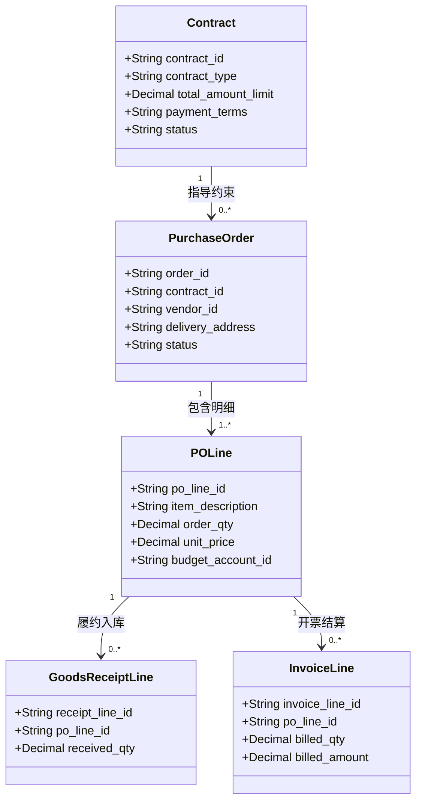
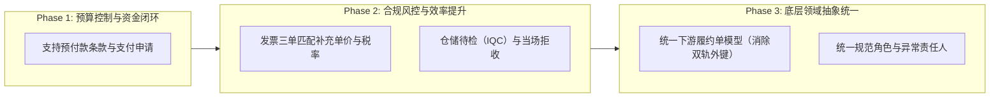

# 采购业务平台流程设计审查与优化建议报告

**文档版本**：v1.2  
**审查基准**：[platform/README.md](../README.md)（采购流程总览与逐步执行流程）  
**参考文档**：[PROCUREMENT.md](PROCUREMENT.md)、[DESIGN.md](DESIGN.md)、[AGENTS.md](../../AGENTS.md)  
**审查维度**：业务时序合理性、企业内控与合规风控、财务预算与资金闭环、运营效率、底层领域建模抽象

---

## 目录

- [一、 审查结论与问题全景表](#一-审查结论与问题全景表)
- [二、 履约交付、验收与仓储管理问题](#二-履约交付验收与仓储管理问题)
  - [2.1 实物收货混淆“物理到货”与“质检入库（IQC）”](#21-实物收货混淆物理到货与质检入库iqc)
  - [2.2 退货申请发起角色倒置（异常分支 B22）](#22-退货申请发起角色倒置异常分支-b22)
  - [2.3 大额非实物（服务/软件）验收缺乏审批流](#23-大额非实物服务软件验收缺乏审批流)
- [三、 发票匹配与资金结算问题](#三-发票匹配与资金结算问题)
  - [3.1 缺失预付款（Prepayment）与先款后货机制，与软件/订阅定位冲突](#31-缺失预付款prepayment与先款后货机制与软件订阅定位冲突)
  - [3.2 发票三单匹配（3-Way Matching）未明确单价与税率校验](#32-发票三单匹配3-way-matching未明确单价与税率校验)
  - [3.3 实际付款后复核拒绝导致账实不一致的逻辑缺陷](#33-实际付款后复核拒绝导致账实不一致的逻辑缺陷)
- [四、 底层领域模型与架构一致性建议](#四-底层领域模型与架构一致性建议)
  - [4.1 “直接履约合同”与“采购订单”双轨执行导致底层模型分裂](#41-直接履约合同与采购订单双轨执行导致底层模型分裂)
  - [4.2 角色权限与职责定义不一致](#42-角色权限与职责定义不一致)
- [五、 重构实施演进建议](#五-重构实施演进建议)

---

## 一、 审查结论与问题全景表

经全面梳理，[platform/README.md](../README.md) 的流程设计整体骨架清晰、覆盖了从需求到结算的全生命周期（注：原“申请审批与采购分派时序倒置”、“预算只看不占缺乏预占机制”、“合同签后校验预算导致黑合同与违约风险”、“RFQ 定标审批后订单重复全量审批”、“报价接收未设密封开标导致泄标串标漏洞”、“发标前强制要求供应商完全准入阻断外部公开竞争”等核心时序、合规与权责问题已在基线中重构闭环，前置立项审批、建立预算预占生命周期、落地签前锁定、RFQ定标免除无偏离重复审批、确立盲收与集中开标解密机制、开放潜在供应商参与寻源并后置准入控制）。当前待处理的 8 个重点漏洞与优化项汇总如下：

| 序号 | 问题分类 | 问题简述 | 严重等级 | 涉及步骤/位置 |
| :--- | :--- | :--- | :--- | :--- |
| 1 | **仓储履约** | 收货即过账入库并转预算执行，缺少质检（IQC）与当场拒收 | **中度** | 阶段 9 (54-56) |
| 2 | **角色权责** | 仓储退货申请由“采购员”发起，权责错位 | **中度** | 异常分支 B22 |
| 3 | **内控风控** | 大额非实物（服务/软件）验收单人提交即生效，无审批流 | **严重** | 阶段 9 (57-59) |
| 4 | **财务结算** | 强制先履约后开票付款，排斥预付款，软件/订阅采购无法走通 | **致命** | 阶段 10 (62), 阶段 11 (67), S25 |
| 5 | **财务匹配** | 发票匹配规则只写“按净收货量”，遗漏单价、税率三单匹配 | **中度** | 阶段 10 (63) |
| 6 | **资金闭环** | 线下出款后线上复核可“拒绝”，导致银行流水与系统账永久脱离 | **严重** | 阶段 12 (72-76) |
| 7 | **架构抽象** | “直接履约合同”与“订单”双轨执行，导致下游外键与逻辑严重分裂 | **严重** | 阶段 8 (46), 阶段 9, 10, 11 |
| 8 | **架构抽象** | 流程中突兀出现未在角色表定义的角色（如“异常负责人”） | **轻度** | 阶段 13 (80) |

---

## 二、 履约交付、验收与仓储管理问题

### 2.1 实物收货混淆“物理到货”与“质检入库（IQC）”

#### 现状分析
- 步骤 54-56：仓管员核验实物到货后登记收货单并过账；步骤 56 规定收货过账立即“触发库存、履约进度及预算执行记录的原子更新”。

#### 为什么不合理
1. **可用库存与质量风险**：工业物料、设备或原材料通常需要 1~3 天的抽检/化验。仓管员在卸货码头点击收货后，物资若直接进入“可用库存”并转预算执行，可能导致缺陷物料被车间领用出库；
2. **退货流程过重**：若送来的货物严重破损或规格明显发错，码头应当场**拒收（Dock Rejection）**。当前流程中因直接过账成了库存，必须被迫走一套“入库过账 -> 占用转执行 -> 提退货申请 -> 退货审批 -> 退货过账 -> 财务纠错”，流程极其繁琐。

#### 建议方案
- 状态机细化：`物理到货 (待检区/待检库存)` → `质检合格 (入库可用，转预算执行)` / `质检不合格 (转退货/拒收)`；
- 增加“码头当场拒收记录”，不产生库存入库流水，不结转财务预算。

---

### 2.2 退货申请发起角色倒置（异常分支 B22）

#### 现状分析
- 异常分支 B22：实物需要退货时，由“采购员”提交退货申请。

#### 为什么不合理
- 货物存放于仓库现场，发现货物损坏、过期、锈蚀或质检不合格的执行人是**仓管员、质检员或使用部门**。
- 采购员不在仓储一线，让采购员去提实物退库单在权责分工上脱节。采购员的角色应是介入与供应商的商务交涉（索赔、折让、补货安排）。

#### 建议方案
- 实物退货申请应由**仓管员或质检员/使用人**发起；
- 采购员与财务人员在审批节点中负责商业与结算确认。

---

### 2.3 大额非实物（服务/软件）验收缺乏审批流

#### 现状分析
- 步骤 57-59：非实物分支由业务验收人核验交付、提交验收结果，平台直接登记结果并结转预算执行。

#### 为什么不合理
- 实物收货有实物资产入库、仓管员单据、盘点等多重稽核；
- 但非实物（如数百万元的咨询成果、软件系统上线、外包服务期验收）直接决定了资金的支付依据。仅由单个“业务验收人”提交即自动生效并转预算执行，存在巨大的人为道德风险与舞弊空间。

#### 建议方案
- 非实物验收单应支持配置**验收确认审批流**（根据金额阈值由项目负责人、业务部门总监会签）。

---

## 三、 发票匹配与资金结算问题

### 3.1 缺失预付款（Prepayment）与先款后货机制，与软件/订阅定位冲突

#### 现状分析
- 平台在第 14 行明确提出“覆盖实物、服务、软件许可及订阅等采购类型”；
- 但在阶段 10 步骤 62 强制要求发票必须关联“对应收货或非实物验收”；阶段 11 步骤 67 规定普通付款必须“基于已确认应付发票”；
- 并在第 155 行（S25）和第 163 行把“预付款”列为特殊结算异常且暂不支持。

#### 为什么不合理
> [!IMPORTANT]
> **业务断点**：SaaS 订阅、软件 License 年费、大型设备定金等采购场景，**几乎 100% 是“先款后货”或“先票后用”**。
> 按照当前流程设计，在没有完成履约验收前，发票根本无法关联，付款申请根本无法发起。这会导致实际业务中，业务人员为了能付首付款或年费，被迫在系统里“虚假录入”一个根本还没发生的非实物验收，彻底破坏了财务审计的严肃性。

#### 建议方案
- 在合同与订单模型中增加**支付条款/支付计划（Payment Terms / Schedule）**：
  - 允许设置预付比例（如“签署后支付 30% 预付款”）；
  - 支持直接基于合同/订单发起“预付款申请（Prepayment Requisition）”；
  - 待后续实际到货或验收后，在发票核对环节进行“预付款对冲（Clearing / Offset）”。

---

### 3.2 发票三单匹配（3-Way Matching）未明确单价与税率校验

#### 现状分析
- 步骤 63：平台执行发票匹配时仅注明“实物按净收货量核对；服务按已验收金额或范围核对；差异转人工处理”。

#### 为什么不合理
- 财务标准三单匹配（PO - Receipt - Invoice）的核心不仅是“数量是否超收”，更重要的是**防范价格超额和税率偏差**。
- 漏掉对单价和税率的自动校验，极易导致下游实施时开发人员仅做了数量校验，忽略了供应商开票单价上浮或税率变动带来的资金流失风险。

#### 建议方案
- 明确发票核对的四大维度：
  1. **数量匹配**：开票量 $\le$ 累计有效合格收货量；
  2. **单价匹配**：发票不含税单价 $\le$ 订单单价（或在允许容差内）；
  3. **税率匹配**：发票税率 $=$ 订单约定税率；
  4. **金额匹配**：发票总额 $=$ 开票量 $\times$ 单价 $+$ 税额。

---

### 3.3 实际付款后复核拒绝导致账实不一致的逻辑缺陷

#### 现状分析
- 步骤 72：付款经办人在企业线下支付渠道执行真实划款；
- 步骤 73：财务登记人录入实际付款流水与凭证；
- 步骤 76：付款复核人提交复核决定（“通过、退回或拒绝；退回修正记录不代表银行撤销支付”）。

#### 为什么不合理
- 钱已经在步骤 72 真实从公司银行账户转出。如果复核人执行“拒绝”，该笔付款记录在系统中作废，但银行账户里的钱已经没了。这会导致系统账本余额与银行真实对账单永久不平（账外资金流出）。

#### 建议方案
- 出纳划款前的**付款授权审批（步骤 70）**是最终的支出决策；
- 划款后的“登记复核”实质是**银行对账与会计记账稽核**：
  - 复核状态只允许“确认归档”或“打回经办人修正录入凭证（如流水号输错、水单图片模糊）”；
  - 严禁提供导致真实划款在账务上被凭空抹去的“直接拒绝”分支。

---

## 四、 底层领域模型与架构一致性建议

根据 [AGENTS.md](../../AGENTS.md) 提出的要求：
> “*当前项目处于开发阶段，无需考虑历史迁移问题；功能调整应从最底层正确抽象开始，再同步修改所有上层调用方；不添加兼容层、转发方法或旧接口别名。*”

### 4.1 “直接履约合同”与“采购订单”双轨执行导致底层模型分裂

#### 现状问题
- 文档定义了两种履约模式：一种是生成“采购订单”去履约；另一种是“合同直接履约，不建立订单”。
- 这导致整个系统下游的所有业务单据（实物收货单、非实物验收单、发票匹配明细、付款申请明细、预算执行流水）必须在数据结构上采用**双轨多态外键**：
  - `receipt_item.order_line_id` OR `receipt_item.contract_line_id`
  - `invoice_item.order_line_id` OR `invoice_item.contract_line_id`
  - `budget_journal.order_line_id` OR `budget_journal.contract_line_id`
- 在所有状态机、并发锁和业务校验中，都需要不断编写 `if order ... else if contract ...`。

#### 正确的底层抽象（DDD 聚合设计）
在采购领域中，合同与订单的职责应当清晰分离，而非平行替代：
- **合同（Contract / Agreement）**：是**法律与商务框架聚合**。管理合同文本、双方签署、总金额上限、价格目录、支付条款、违约责任。它不负责具体的物流调度。
- **采购订单 / 执行单（Purchase Order / Fulfillment Order）**：是**唯一的履约与结算指令聚合**。管理送货地址、指定库位、交货批次日期、收货行、发票行与实付款行。

> [!TIP]
> **架构收益**：
> 即使是单笔业务，也由系统自动根据合同生成一张标准的订单执行单（Fulfillment Order）。下游所有的仓储收退货、验收单、发票匹配和付款申请**只认唯一的 `po_line_id`**。底层数据库模型彻底消除多态外键和二元分叉，大幅降低系统复杂度。

---

### 4.2 角色权限与职责定义不一致

#### 现状分析
- 在步骤 80 中，出现了一个名为“**异常负责人**”的角色，但在 [DESIGN.md 2.1 角色清单](DESIGN.md#21-角色与责任) 中根本没有定义该角色。
- 供应商履约评价仅由“采购员”单方提交（步骤 82），缺少仓库（交付准时与残损）、质检（品质合格）、业务使用方（服务质量）和财务（发票结算配合度）的打分维度。

#### 建议方案
- 将“异常负责人”明确归位到具体的业务责任人（如质量异常归质检员，发票差异归财务，交付延期归采购员）；
- 供应商评价支持多角色综合评分。

---

## 五、 重构实施演进建议

建议按如下 3 个阶段进行底层到上层的系统性重构与修订：

